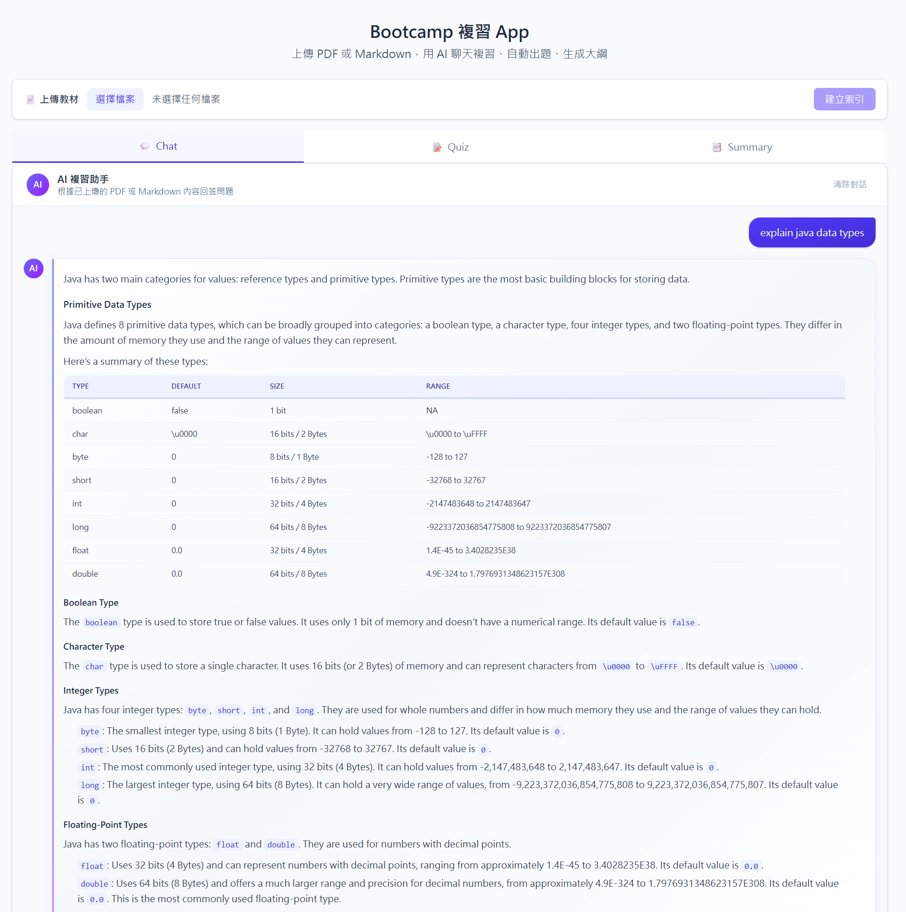
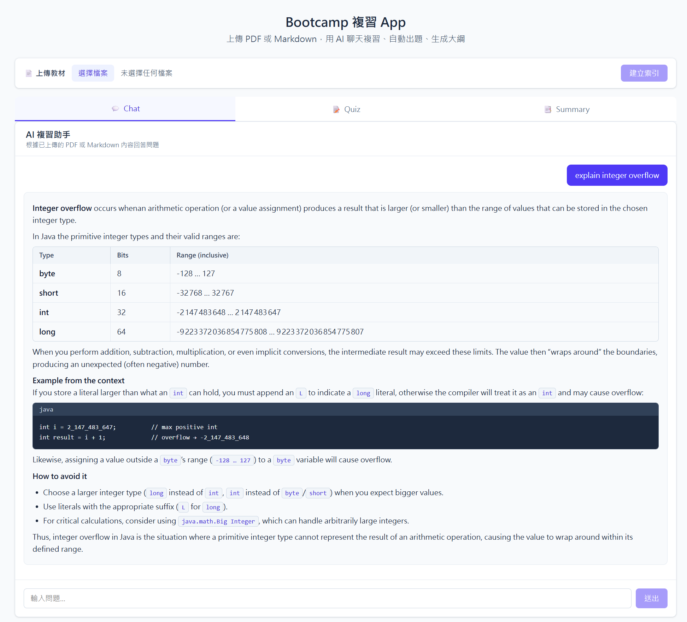
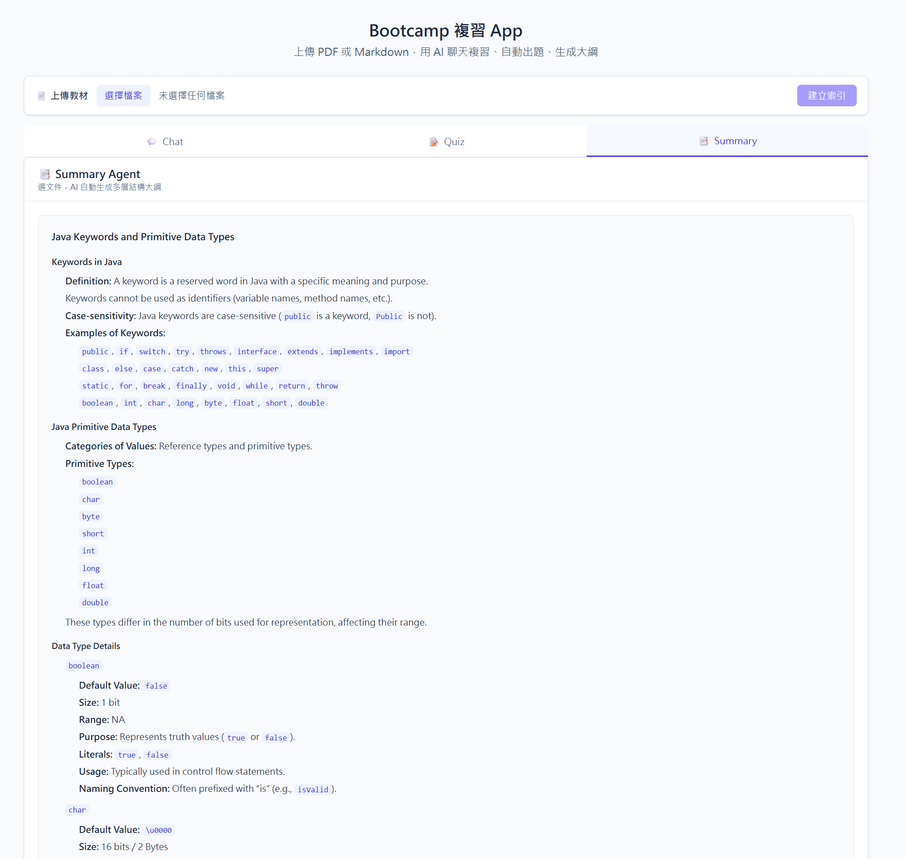

**🌐 Language / 語言：** [English](README.en.md) | **中文**

# 📚 Bootcamp 複習 App

> AI 驅動嘅 Bootcamp 教材複習平台 — 支援 PDF/Markdown 上傳、RAG 聊天、自動出題、知識缺口分析同大綱生成。  
> 全部使用免費方案運行。

---

## ✨ 功能一覽

| 功能 | 描述 |
|------|------|
| 📄 **文件上傳** | 支援 PDF、Markdown 格式上傳，自動向量化索引 |
| 💬 **RAG 聊天** | 根據上傳文件內容回答問題（Streaming 即時回覆） |
| 📝 **Quiz 出題** | AI 自動根據文件生成多選題，即時評分 |
| 🎯 **知識缺口** | 分析 Quiz 錯誤率，識別弱項 Topic |
| 📋 **Summary** | AI 生成文件大綱摘要（Streaming） |

---

## 📸 Screenshots

### 💬 Chat — AI 問答複習


### 📝 Quiz — 自動出題 & 即時評分


### 📋 Summary — AI 大綱摘要


---

## 🛠️ 技術棧

| 層級 | 技術 | 版本 / 備註 |
|------|------|-------------|
| **Framework** | Next.js | 16.1.6（Turbopack） |
| **Language** | TypeScript | 5.7+ |
| **Frontend** | React | 19.x |
| **Styling** | Tailwind CSS | 3.4 |
| **Database** | MongoDB Atlas | M0 免費叢集（512MB） |
| **ODM** | Mongoose | 8.8 |
| **LLM Chat** | OpenRouter → `nvidia/nemotron-3-nano-30b-a3b:free` | 免費 |
| **Embedding** | OpenRouter → `nvidia/llama-nemotron-embed-vl-1b-v2:free` | 免費 |
| **RAG Chain** | LangChain (`@langchain/openai`, `@langchain/core`) | Prompt + Streaming |
| **Text Splitting** | `@langchain/textsplitters` | RecursiveCharacterTextSplitter |
| **PDF 解析** | LlamaParse REST API | 多語言、掃描 PDF 支援 |
| **Markdown 渲染** | `react-markdown` + `remark-gfm` | GFM 語法支援 |

---

## 💸 免費方案

| 服務 | 方案 | 限制 |
|------|------|------|
| MongoDB Atlas | M0 免費叢集 | 512MB 儲存，支援向量搜尋 |
| OpenRouter | Free tier models | Rate limit 因模型不同 |
| LlamaCloud | Free tier | 每日解析頁數限額 |
| Vercel | Free tier | 部署託管 |

---

## 🚀 快速開始

### 1. 安裝依賴

```bash
npm install
```

### 2. 環境變數

```bash
cp .env.example .env.local
```

填入以下變數（詳見 [`.env.example`](.env.example)）：

| 變數 | 描述 |
|------|------|
| `MONGODB_URI` | MongoDB Atlas 連線字串 |
| `OPENROUTER_API_KEY` | [OpenRouter](https://openrouter.ai/keys) API Key |
| `OPENROUTER_MODEL` | Chat LLM 模型（預設 `nvidia/nemotron-3-nano-30b-a3b:free`） |
| `OPENROUTER_EMBED_MODEL` | Embedding 模型（預設 `nvidia/llama-nemotron-embed-vl-1b-v2:free`） |
| `LLAMA_CLOUD_API_KEY` | [LlamaCloud](https://cloud.llamaindex.ai/api-key) API Key（PDF 解析） |

### 3. MongoDB Atlas 向量索引

在 Atlas 中為 `chunks` collection 建立向量搜尋索引：

1. Atlas → 你的叢集 → **Search** → **Create Index**
2. 選擇 **JSON Editor**，貼上 [`scripts/vector-index.json`](scripts/vector-index.json) 內容：

```json
{
  "name": "chunk_vector_index",
  "type": "vectorSearch",
  "definition": {
    "fields": [
      {
        "type": "vector",
        "path": "embedding",
        "numDimensions": 2048,
        "similarity": "cosine"
      }
    ]
  }
}
```

> 📖 詳細步驟請參閱 [`docs/MONGODB_VECTOR_SETUP.md`](docs/MONGODB_VECTOR_SETUP.md)

### 4. 啟動開發伺服器

```bash
npm run dev
```

開啟 [http://localhost:3000](http://localhost:3000)

---

## 📖 使用方式

1. **上傳文件** — 左側上傳 Bootcamp PDF 或 Markdown 教材
2. **聊天複習** — Chat Tab 輸入問題，AI 根據文件內容即時回覆
3. **Quiz 測驗** — Quiz Tab 選擇文件，AI 自動出題，即時評分
4. **知識缺口** — Quiz 完成後查看弱項分析
5. **大綱摘要** — Summary Tab 一鍵生成文件大綱

---

## 🏗️ 專案結構

```
revision-app/
├── src/
│   ├── app/
│   │   ├── api/
│   │   │   ├── chat/route.ts          # RAG 聊天（Streaming）
│   │   │   ├── documents/route.ts     # 文件列表 API
│   │   │   ├── ingest/route.ts        # PDF/MD 上傳 → 向量化
│   │   │   ├── quiz/
│   │   │   │   ├── generate/route.ts  # AI 自動出題
│   │   │   │   ├── submit/route.ts    # 提交答案 & 評分
│   │   │   │   └── stats/route.ts     # 答題統計
│   │   │   └── summary/
│   │   │       └── generate/route.ts  # AI 大綱摘要（Streaming）
│   │   ├── globals.css
│   │   ├── layout.tsx
│   │   └── page.tsx                   # 主頁（Tab 切換）
│   ├── components/
│   │   ├── ChatBox.tsx                # 聊天界面（streaming）
│   │   ├── FileUpload.tsx             # 文件上傳
│   │   ├── KnowledgeGap.tsx           # 知識缺口分析
│   │   ├── QuizPanel.tsx              # Quiz 出題 & 作答
│   │   ├── SummaryPanel.tsx           # 大綱摘要
│   │   ├── TabNav.tsx                 # Tab 導航
│   │   └── UploadToast.tsx            # 上傳通知 Toast
│   ├── context/
│   │   └── UploadContext.tsx          # 上傳狀態全域 Context
│   ├── hooks/
│   │   ├── useQuiz.ts                 # Quiz 邏輯 Hook
│   │   ├── useStats.ts                # 統計數據 Hook
│   │   └── useToast.ts                # Toast 通知 Hook
│   ├── lib/
│   │   ├── __tests__/                 # 單元測試
│   │   ├── chunking.ts               # LangChain 文本分割
│   │   ├── db.ts                      # MongoDB 連線（Singleton）
│   │   ├── embedding.ts              # OpenRouter Embedding API
│   │   ├── llm.ts                     # LLM Client 配置
│   │   ├── md.ts                      # Markdown 解析
│   │   ├── pdf.ts                     # PDF 文字擷取
│   │   └── search.ts                 # 向量搜尋 + 關鍵字備援
│   └── models/
│       ├── Chunk.ts                   # 文本 Chunk（含 embedding）
│       ├── Document.ts              # 上傳文件記錄
│       └── QuizAttempt.ts           # Quiz 答題記錄
├── scripts/
│   └── vector-index.json             # Atlas 向量索引定義
└── docs/                             # 📖 項目文檔
```

---

## 📚 項目文檔

所有文檔存放喺 [`docs/`](docs/) 目錄（中文）同 [`docs/en/`](docs/en/) 目錄（英文），亦可喺 [📘 Confluence Wiki](https://johnmak101.atlassian.net/wiki/spaces/REV) 上瀏覽。

### 📋 項目規劃

| 文檔 | 描述 |
|------|------|
| [📄 PROJECT_OVERVIEW.md](docs/PROJECT_OVERVIEW.md) | 項目總覽 — 核心功能、技術棧、免費方案 |
| [📄 ARCHITECTURE.md](docs/ARCHITECTURE.md) | 系統架構 — 目錄結構、數據模型、核心流程、設計決策 |
| [📄 GLOSSARY.md](docs/GLOSSARY.md) | 術語表 — 項目相關技術術語定義 |

### 📐 需求與設計

| 文檔 | 描述 |
|------|------|
| [📄 USE_CASES.md](docs/USE_CASES.md) | 用例描述 — 系統功能用例（含前置/後置條件） |
| [📄 USER_STORIES.md](docs/USER_STORIES.md) | 用戶故事 — Agile 用戶故事列表 |
| [📄 DEFINITION_OF_DONE.md](docs/DEFINITION_OF_DONE.md) | 完成定義 — 各功能嘅 DoD 標準 |
| [📄 NON_FUNCTIONAL_REQUIREMENTS.md](docs/NON_FUNCTIONAL_REQUIREMENTS.md) | 非功能需求 — 性能、安全、可用性要求 |

### 🎨 UI/UX

| 文檔 | 描述 |
|------|------|
| [📄 UI_FLOW_DIAGRAM.md](docs/UI_FLOW_DIAGRAM.md) | 畫面流程圖 — Tab 導航、用戶操作流程（Mermaid） |

### 🔌 API

| 文檔 | 描述 |
|------|------|
| [📄 API_REFERENCE.md](docs/API_REFERENCE.md) | API 參考 — 所有端點嘅請求/回應格式 |

### 🧪 測試與追蹤

| 文檔 | 描述 |
|------|------|
| [📄 TEST_PLAN.md](docs/TEST_PLAN.md) | 測試計劃 — 測試策略、具體測試案例 |
| [📄 TRACEABILITY_MATRIX.md](docs/TRACEABILITY_MATRIX.md) | 追蹤矩陣 — Use Case ↔ User Story ↔ Test Case 映射 |

### ⚙️ 部署與設定

| 文檔 | 描述 |
|------|------|
| [📄 SETUP_GUIDE.md](docs/SETUP_GUIDE.md) | 安裝指南 — 詳細開發環境設置步驟 |
| [📄 MONGODB_VECTOR_SETUP.md](docs/MONGODB_VECTOR_SETUP.md) | MongoDB 向量搜尋設定 — Atlas 索引建立教學 |

---

## 🌐 部署到 Vercel

1. 推送至 GitHub
2. 在 [Vercel](https://vercel.com) 匯入專案
3. 設定環境變數：`MONGODB_URI`、`OPENROUTER_API_KEY`、`OPENROUTER_MODEL`、`OPENROUTER_EMBED_MODEL`、`LLAMA_CLOUD_API_KEY`
4. 部署

---

Created by **John Mak** 🚀

*更新日期：2026-03-21*
