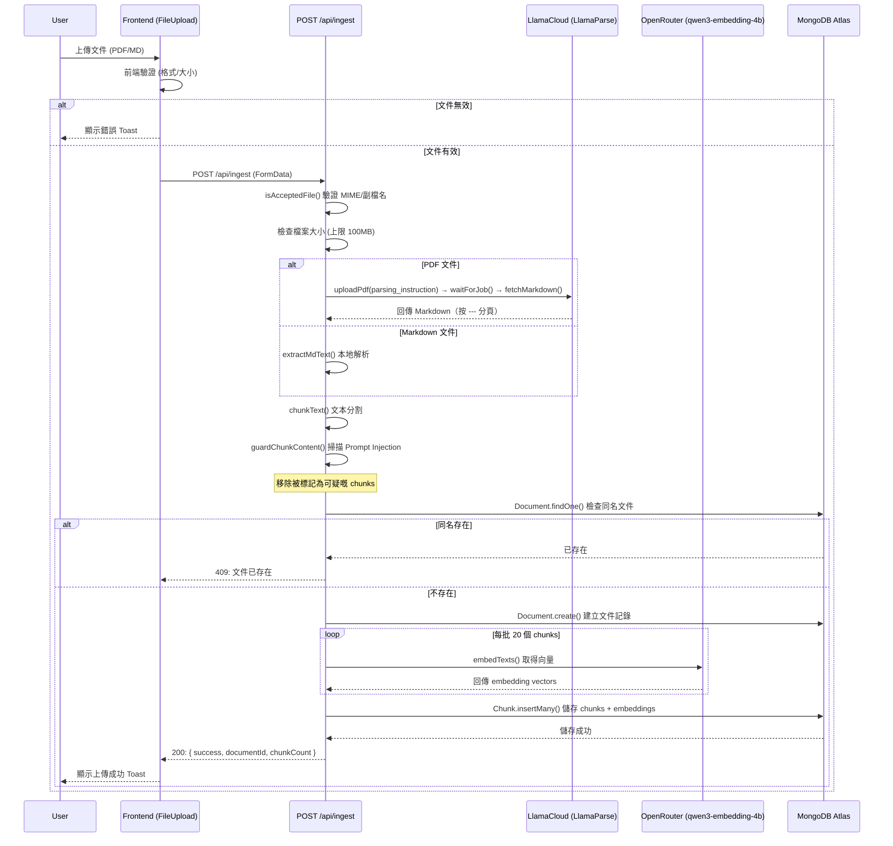
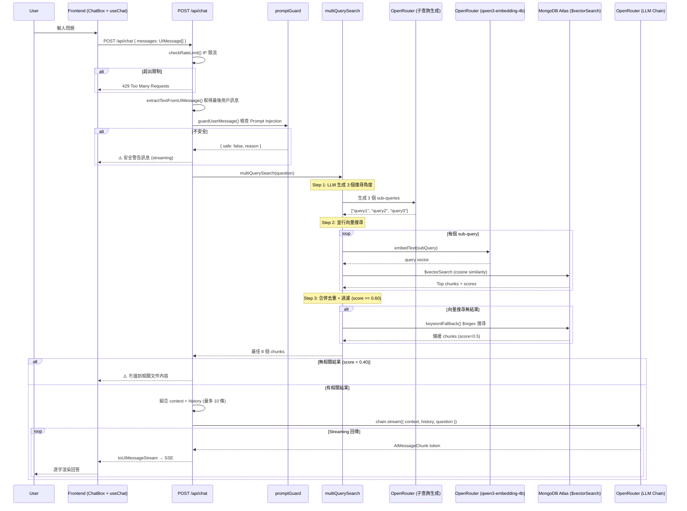
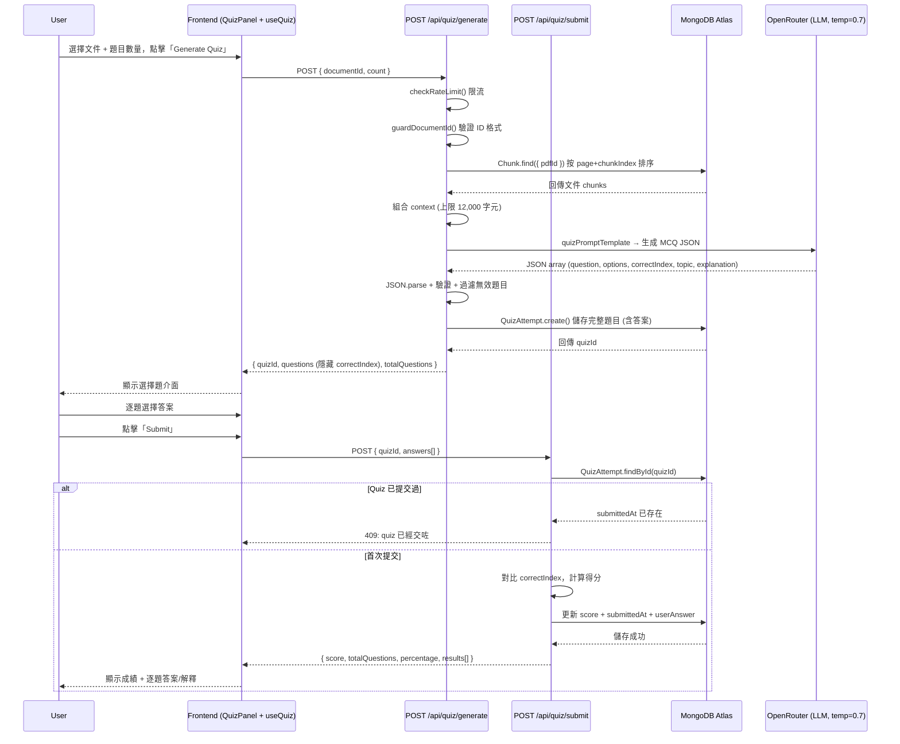
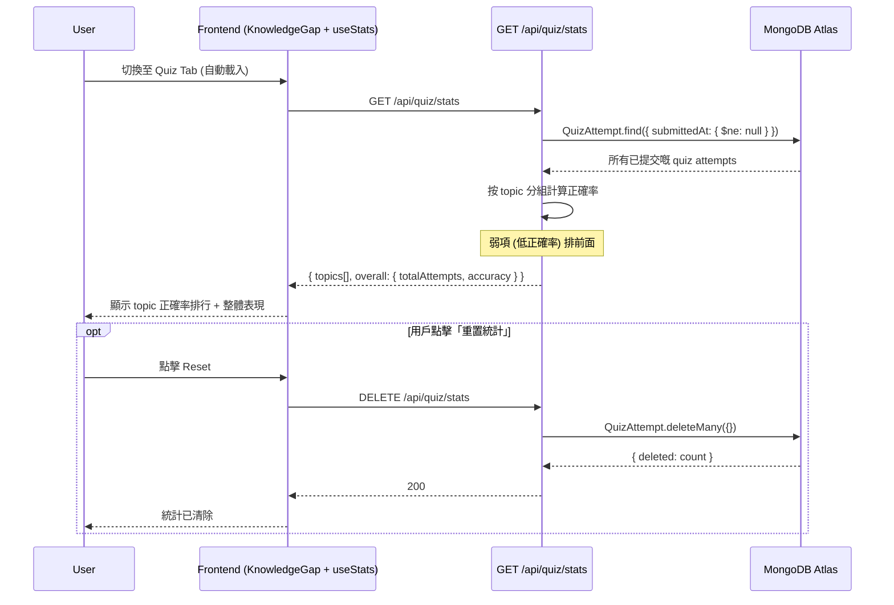
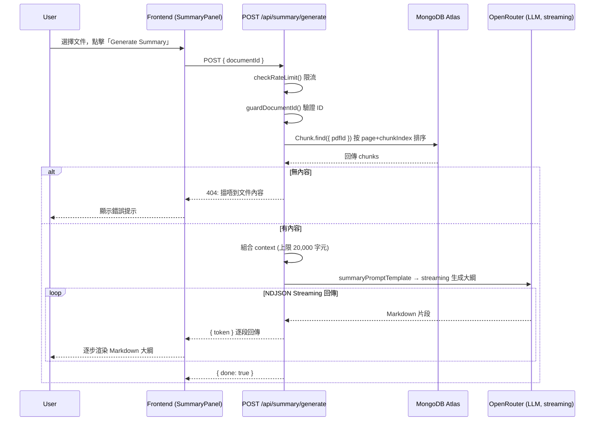
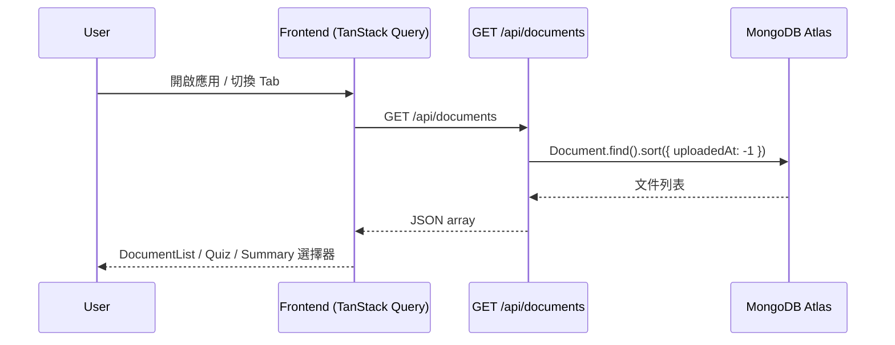
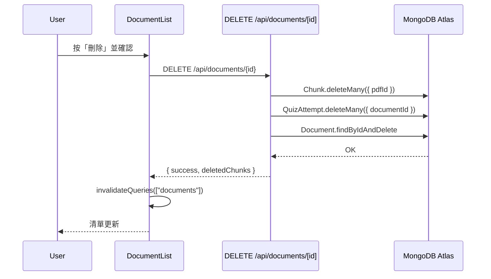

# 系統時序圖 (Sequence Diagrams)

以下是 Revision App 各個核心功能嘅時序圖 (Sequence Diagrams)，全部對照 `src/` 目錄下嘅實際程式碼繪製。

---

## 1. 文件上傳與處理時序圖 (Document Ingestion Flow)

> 對應程式碼：`src/app/api/ingest/route.ts`、`src/lib/pdf.ts`、`src/lib/md.ts`、`src/lib/chunking.ts`、`src/lib/embedding.ts`、`src/lib/promptGuard.ts`

---

## 2. RAG 智能問答時序圖 (Chat RAG Flow)

> 對應程式碼：`src/app/api/chat/route.ts`、`src/lib/search.ts`、`src/lib/promptGuard.ts`、`src/lib/rateLimiter.ts`

---

## 3. 測驗生成與提交時序圖 (Quiz Generation & Submission Flow)

> 對應程式碼：`src/app/api/quiz/generate/route.ts`、`src/app/api/quiz/submit/route.ts`、`src/hooks/useQuiz.ts`

---

## 4. Knowledge Gap 分析時序圖 (Quiz Stats Flow)

> 對應程式碼：`src/app/api/quiz/stats/route.ts`、`src/components/KnowledgeGap.tsx`、`src/hooks/useStats.ts`

---

## 5. 懶人包生成時序圖 (Summary Generation Flow)

> 對應程式碼：`src/app/api/summary/generate/route.ts`、`src/components/SummaryPanel.tsx`

---

## 6. 文件列表載入時序圖 (Document List Flow)

> 對應程式碼：`src/app/api/documents/route.ts`、`src/components/DocumentList.tsx`、`src/hooks/useQuiz.ts`、`src/components/SummaryPanel.tsx`、`src/context/UploadContext.tsx`（ingest 成功後 `invalidateQueries(["documents"])`）

---

## 7. 刪除已索引文件時序圖 (Delete Document Flow)

> 對應程式碼：`src/app/api/documents/[id]/route.ts`、`src/components/DocumentList.tsx`

---
*更新日期：2026-03-25 — 全部時序圖已對照 `src/` 目錄實際程式碼驗證*
