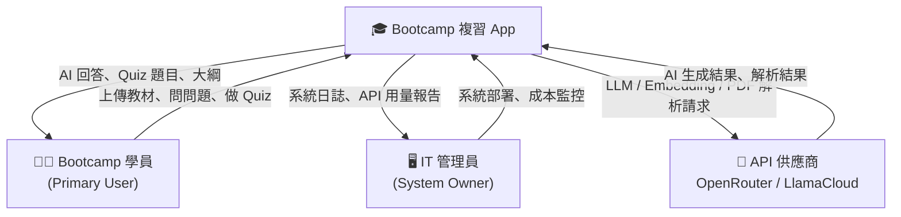

# 利益相關者地圖 (Stakeholder Map)

> **目的**：識別所有影響或受系統影響嘅利益相關者，了解佢哋嘅需求、關注點同溝通策略，確保系統設計平衡各方利益。

---

## 利益相關者概覽



---

## 詳細 Stakeholder 分析

### 1. 👩‍🎓 Bootcamp 學員 (Primary User)

| 屬性 | 描述 |
|------|------|
| **角色** | 主要終端用戶，直接使用系統複習教材 |
| **主要需求** | 快速搵到教材答案、通過測試自我評估、了解自己嘅弱項 |
| **關注點** | 回應速度（等太耐忍受度低）、AI 答案準確性、介面易用性 |
| **成功標準** | 檢索教材時間減少 30%，Quiz 正確率提升 20% |
| **風險** | 如果 AI 產生 Hallucination，學員可能學錯知識 |
| **溝通方式** | 系統內錯誤提示、UI feedback、用戶調查問卷 |
| **參與度** | 🔴 高（持續使用） |

---

### 2. 🖥️ IT 管理員 (System Owner)

| 屬性 | 描述 |
|------|------|
| **角色** | 負責系統部署、維護同成本管控 |
| **主要需求** | 系統穩定運行、安全合規、可控嘅 API 成本 |
| **關注點** | MongoDB Atlas 用量（M0 512MB 上限）、OpenRouter API 費用、安全漏洞 |
| **成功標準** | 系統可用性 ≥ 99%、月度 API 費用在預算內、零安全事故 |
| **風險** | 免費 tier 限制被突破、rate limiting 失效導致費用爆升 |
| **溝通方式** | 系統日誌、API 用量儀表板、定期成本報告 |
| **參與度** | 🟡 中（每月監控） |

---

### 3. 🔌 API 供應商 (OpenRouter / LlamaCloud)

| 屬性 | 描述 |
|------|------|
| **角色** | 提供 LLM、Embedding 同 PDF 解析服務嘅技術合作夥伴 |
| **主要需求** | 合理使用 API（符合 Rate Limits 同 Terms of Service） |
| **關注點** | 請求頻率、資料隱私合規、免費 tier 用量限制 |
| **成功標準** | 系統請求行為符合供應商 ToS，冇觸發濫用警告 |
| **風險** | 免費 tier 停止提供、模型下線需要切換（OpenRouter 統一 API 可緩解）|
| **溝通方式** | API 文檔、供應商 Status Page、錯誤回傳訊息 |
| **參與度** | 🟢 低（被動，按需） |

---

## 需求衝突分析與平衡策略

不同 Stakeholder 之間存在潛在嘅需求衝突，BA 需要識別並提出平衡方案：

| 衝突場景 | Stakeholder A 需求 | Stakeholder B 需求 | 平衡策略 |
|----------|-------------------|-------------------|----------|
| 回應速度 vs 準確性 | 學員：希望即時回答 | IT 管理員：希望控制 API 成本 | 設置 Rate Limiting（20 req/min），在速度同成本間取平衡 |
| 文件解析品質 vs 成本 | 學員：希望所有 PDF 都能準確解析 | IT 管理員：LlamaCloud 免費 tier 有頁數限制 | 採用 LlamaParse + `parsing_instruction` 提升掃描件及表格準確度，同時前端提示用量限制 |
| AI 自由度 vs 安全性 | 學員：希望 AI 盡量回答更多問題 | IT 管理員：防止 Prompt Injection 同系統濫用 | Vard Guard + Chunk Content Guard 在不影響正常使用嘅前提下阻擋惡意操作 |

---

## Stakeholder Interest / Power Matrix

```
          高影響力 (High Power)
               │
    IT 管理員   │
    (決定部署   │
     同預算)    │
               │                    學員
               │              (最終產品成功與否
High ──────────┼────────────── 取決於佢哋嘅採用率)
Interest       │
               │
               │    API 供應商
               │    (外部依賴，
               │     被動參與)
               │
          低影響力 (Low Power)
```

| 象限 | Stakeholder | 策略 |
|------|-------------|------|
| 高影響力 + 高關注度 | IT 管理員 | **密切管理**：定期提供系統報告，主動溝通成本變化 |
| 低影響力 + 高關注度 | Bootcamp 學員 | **持續維繫**：重視用戶反饋，快速回應體驗問題 |
| 低影響力 + 低關注度 | API 供應商 | **監控即可**：定期檢查 ToS 變更，設置 API 用量告警 |

---

*更新日期：2026-03-24*
