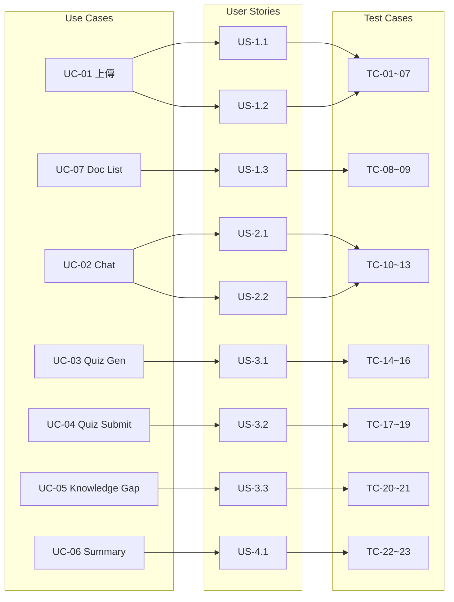

# 需求追蹤矩陣 (Traceability Matrix)

> **目的**：確保每個需求都有對應嘅實現、測試、同驗證，無遺漏。

---

## 1. Use Case ↔ User Story ↔ Test Case 對照表

| Use Case | User Story | Test Case(s) | API Endpoint | UI 組件 | 狀態 |
|----------|-----------|--------------|--------------|---------|------|
| UC-01 上傳 PDF | US-1.1 | TC-01, TC-03, TC-04, TC-05, TC-06, TC-07 | `POST /api/ingest` | `FileUpload` | ✅ 已實現 |
| UC-01 上傳 MD | US-1.2 | TC-02 | `POST /api/ingest` | `FileUpload` | ✅ 已實現 |
| UC-02 RAG 聊天 | US-2.1, US-2.2 | TC-10, TC-11, TC-12, TC-13 | `POST /api/chat` | `ChatBox` | ✅ 已實現 |
| UC-03 Quiz 生成 | US-3.1 | TC-14, TC-15, TC-16 | `POST /api/quiz/generate` | `QuizPanel` | ✅ 已實現 |
| UC-04 Quiz 提交 | US-3.2 | TC-17, TC-18, TC-19 | `POST /api/quiz/submit` | `QuizPanel` | ✅ 已實現 |
| UC-05 知識缺口 | US-3.3 | TC-20, TC-21 | `GET /api/quiz/stats` | `KnowledgeGap` | ✅ 已實現 |
| UC-06 Summary | US-4.1 | TC-22, TC-23 | `POST /api/summary/generate` | `SummaryPanel` | ✅ 已實現 |
| UC-07 文件列表 | US-1.3 | TC-08, TC-09 | `GET /api/documents` | `FileUpload`(dropdown) | ✅ 已實現 |

---

## 2. User Story ↔ Acceptance Criteria ↔ Test Case 詳細對照

### Epic 1：文件管理

| User Story | Acceptance Criteria | Test Case | 覆蓋 |
|-----------|-------------------|-----------|------|
| US-1.1 上傳 PDF | 支援 `.pdf` 格式 | TC-01 | ✅ |
| | 自動擷取文字、分割、embedding、存儲 | TC-01 | ✅ |
| | 顯示成功信息（含 chunk 數量） | TC-01 | ✅ |
| | 同名文件 409 錯誤 | TC-06 | ✅ |
| | 空/損壞文件清晰錯誤提示 | TC-04, TC-07 | ✅ |
| | 文件大小上限 100MB | TC-05 | ✅ |
| US-1.2 上傳 MD | 支援 `.md`、`.markdown` 格式 | TC-02 | ✅ |
| | 處理流程同 PDF 一致 | TC-02 | ✅ |
| US-1.3 查看文件 | 顯示文件名、chunk 數量、上傳時間 | TC-08 | ✅ |
| | 按上傳時間倒序排列 | TC-08 | ✅ |

### Epic 2：RAG 聊天

| User Story | Acceptance Criteria | Test Case | 覆蓋 |
|-----------|-------------------|-----------|------|
| US-2.1 對話複習 | 只基於上傳文件內容回答 | TC-10 | ✅ |
| | 回覆語言與輸入一致 | TC-10 | ✅ |
| | Streaming 逐 token 顯示 | TC-10, TC-NF-02 | ✅ |
| | 保留最近 6 條對話歷史 | TC-13 | ✅ |
| US-2.2 搜尋容錯 | 向量搜尋失敗時 keyword fallback | TC-11 | ✅ |
| | 無相關結果清晰提示 | TC-11 | ✅ |

### Epic 3：Quiz 練習

| User Story | Acceptance Criteria | Test Case | 覆蓋 |
|-----------|-------------------|-----------|------|
| US-3.1 自動出題 | 可選擇目標文件 | TC-14 | ✅ |
| | 題目數量 3-15 | TC-16 | ✅ |
| | 每題 4 個選項 | TC-14 | ✅ |
| | 每題標記 topic + explanation | TC-14 | ✅ |
| | 測試理解力 | TC-14 *(人工驗證)* | ⚠️ |
| | 作答時隱藏正確答案 | TC-14 | ✅ |
| US-3.2 提交評分 | 需全部答完先提交 | TC-17 | ✅ |
| | 顯示分數、百分比 | TC-17 | ✅ |
| | 每題顯示正確答案、我的答案、解釋 | TC-17 | ✅ |
| | 每題標示 topic | TC-17 | ✅ |
| | 同一份 quiz 只能提交一次 | TC-18 | ✅ |
| US-3.3 知識缺口 | 按 topic 分組顯示正確率 | TC-20 | ✅ |
| | 弱項排前面 | TC-20 | ✅ |
| | 顯示整體統計 | TC-20 | ✅ |

### Epic 4：Summary

| User Story | Acceptance Criteria | Test Case | 覆蓋 |
|-----------|-------------------|-----------|------|
| US-4.1 學習大綱 | 可選擇目標文件 | TC-22 | ✅ |
| | 結構化 Markdown（章節、重點、定義） | TC-22 | ✅ |
| | 🔑 標記關鍵知識點 | TC-22 *(人工驗證)* | ⚠️ |
| | Streaming 逐步顯示 | TC-22, TC-NF-02 | ✅ |
| | 語言同原文一致 | TC-22 *(人工驗證)* | ⚠️ |

---

## 3. 覆蓋率統計

### 按 Use Case

| Use Case | Test Cases | Coverage |
|----------|-----------|----------|
| UC-01 | 6 | ✅ 100% |
| UC-02 | 4 | ✅ 100% |
| UC-03 | 3 | ✅ 100% |
| UC-04 | 3 | ✅ 100% |
| UC-05 | 2 | ✅ 100% |
| UC-06 | 2 | ✅ 100% |
| UC-07 | 2 | ✅ 100% |

### 按 User Story

| Metric | 數值 |
|--------|------|
| 總 Acceptance Criteria | 31 |
| 自動測試可覆蓋 | 28 (90%) |
| 需人工驗證 | 3 (10%) |
| 未覆蓋 | 0 (0%) |

### 按 API Endpoint

| Endpoint | Test Cases | 正常流程 | 錯誤處理 |
|----------|-----------|---------|---------|
| `POST /api/ingest` | 6 | TC-01, TC-02 | TC-03, TC-04, TC-05, TC-06, TC-07 |
| `GET /api/documents` | 2 | TC-08 | TC-09 |
| `POST /api/chat` | 4 | TC-10, TC-13 | TC-11, TC-12 |
| `POST /api/quiz/generate` | 3 | TC-14, TC-16 | TC-15 |
| `POST /api/quiz/submit` | 3 | TC-17 | TC-18, TC-19 |
| `GET /api/quiz/stats` | 2 | TC-20 | TC-21 |
| `POST /api/summary/generate` | 2 | TC-22 | TC-23 |

---

## 4. 需人工驗證嘅項目

以下 Acceptance Criteria 涉及 AI 生成品質，難以自動化測試，需要人工 review：

| ID | 項目 | 原因 |
|----|------|------|
| ⚠️ AC-3.1.5 | Quiz 測試理解力 vs 死記硬背 | LLM 輸出品質主觀性 |
| ⚠️ AC-4.1.3 | Summary 🔑 標記關鍵知識點 | 需要 domain expert 驗證 |
| ⚠️ AC-4.1.5 | Summary 語言同原文一致 | 多語言 prompt 行為不穩定 |

---

## 5. 追蹤矩陣圖示

---

*更新日期：2026-03-17*
