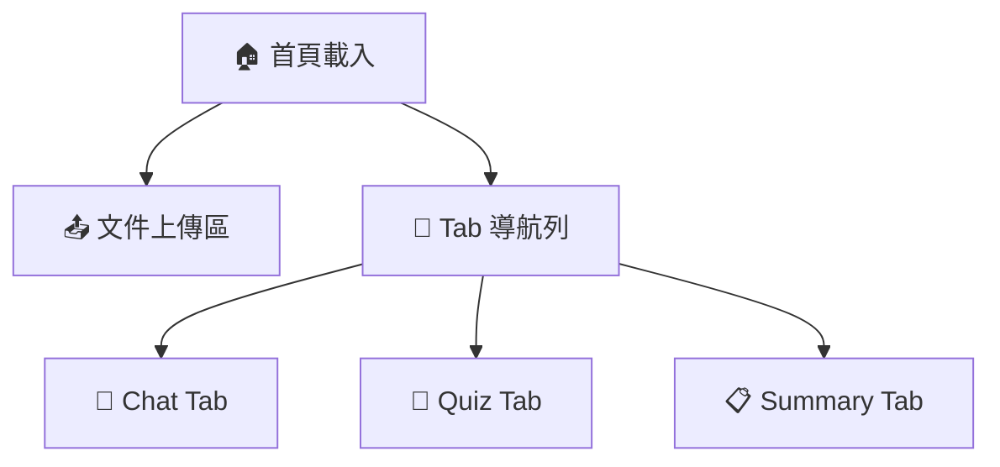
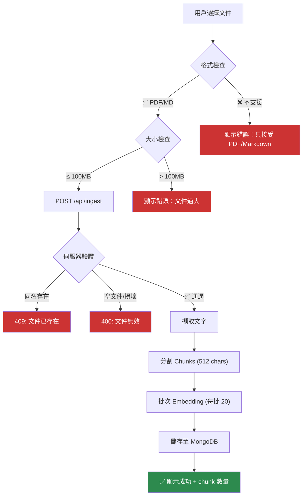
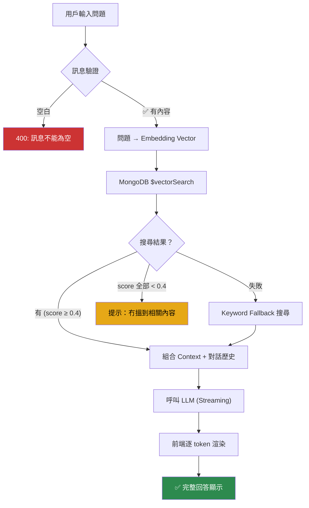
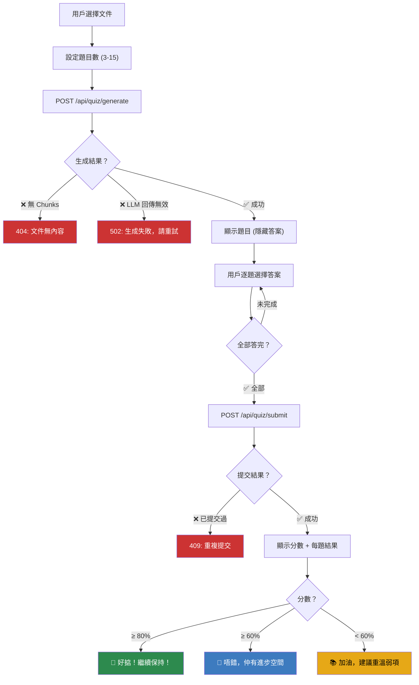
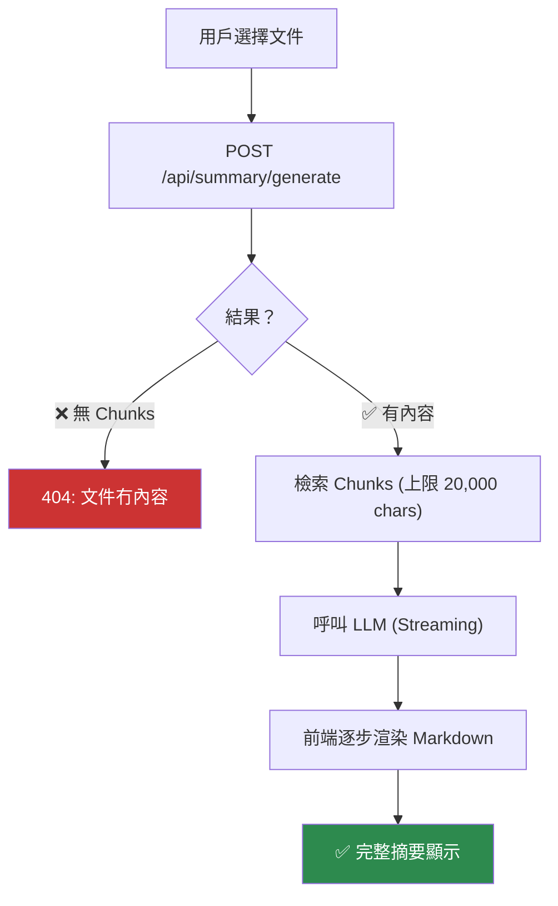
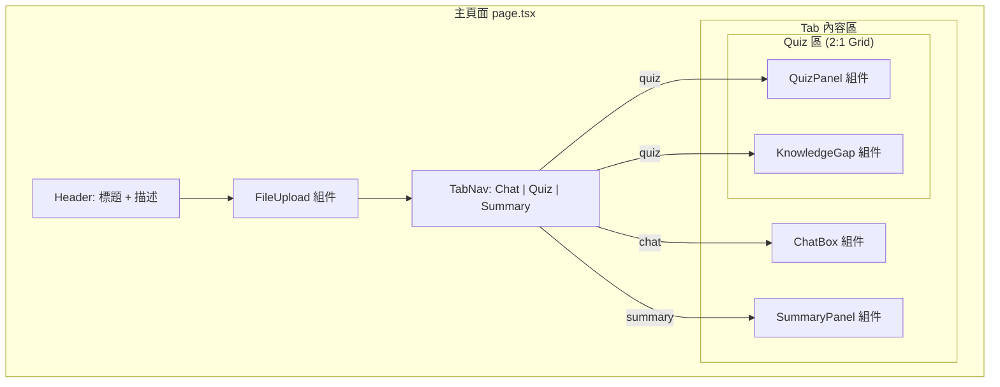
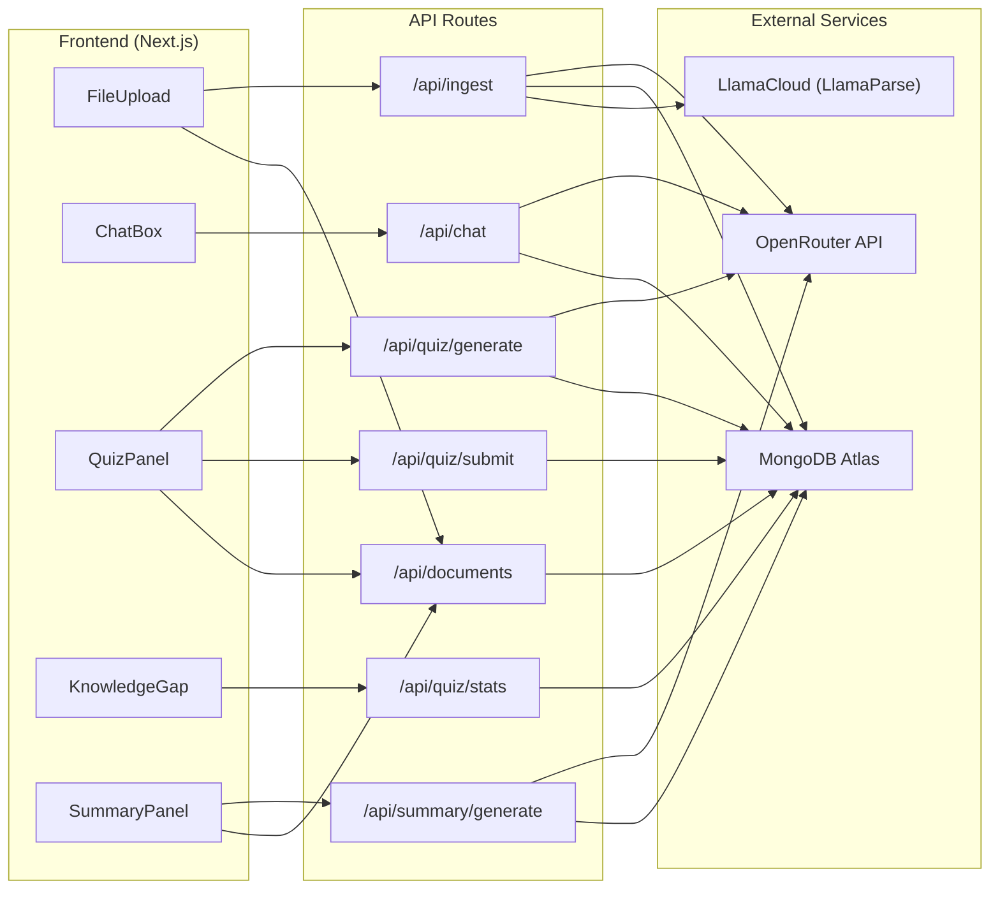

# UI 流程圖 (UI Flow Diagram)

## 1. 應用整體流程

```mermaid
flowchart TD
    START["🏠 首頁載入"]
    UPLOAD["📤 文件上傳區"]
    TAB["📑 Tab 導航列"]
    
    CHAT["💬 Chat Tab"]
    QUIZ["📝 Quiz Tab"]
    SUMMARY["📋 Summary Tab"]
    
    START --> UPLOAD
    START --> TAB
    TAB --> CHAT
    TAB --> QUIZ
    TAB --> SUMMARY
```

---

## 2. 文件上傳流程

```mermaid
flowchart TD
    A["用戶選擇文件"] --> B{"格式檢查"}
    B -->|"✅ PDF/MD"| C{"大小檢查"}
    B -->|"❌ 不支援"| ERR1["顯示錯誤：只接受 PDF/Markdown"]
    
    C -->|"≤ 100MB"| D["POST /api/ingest"]
    C -->|"> 100MB"| ERR2["顯示錯誤：文件過大"]
    
    D --> E{"伺服器驗證"}
    E -->|"同名存在"| ERR3["409: 文件已存在"]
    E -->|"空文件/損壞"| ERR4["400: 文件無效"]
    E -->|"✅ 通過"| F["擷取文字"]
    
    F --> G["分割 Chunks (512 chars)"]
    G --> H["批次 Embedding (每批 20)"]
    H --> I["儲存至 MongoDB"]
    I --> J["✅ 顯示成功 + chunk 數量"]
    
    style J fill:#2d8a4e,color:#fff
    style ERR1 fill:#cc3333,color:#fff
    style ERR2 fill:#cc3333,color:#fff
    style ERR3 fill:#cc3333,color:#fff
    style ERR4 fill:#cc3333,color:#fff
```

---

## 3. RAG 聊天流程

```mermaid
flowchart TD
    A["用戶輸入問題"] --> B{"訊息驗證"}
    B -->|"空白"| ERR1["400: 訊息不能為空"]
    B -->|"✅ 有內容"| C["問題 → Embedding Vector"]
    
    C --> D["MongoDB $vectorSearch"]
    D --> E{"搜尋結果？"}
    
    E -->|"有 (score ≥ 0.4)"| F["組合 Context + 對話歷史"]
    E -->|"失敗"| G["Keyword Fallback 搜尋"]
    E -->|"score 全部 < 0.4"| H["提示：冇搵到相關內容"]
    
    G --> F
    F --> I["呼叫 LLM (Streaming)"]
    I --> J["前端逐 token 渲染"]
    J --> K["✅ 完整回答顯示"]
    
    style K fill:#2d8a4e,color:#fff
    style ERR1 fill:#cc3333,color:#fff
    style H fill:#e6a817,color:#000
```

---

## 4. Quiz 完整流程

```mermaid
flowchart TD
    A["用戶選擇文件"] --> B["設定題目數 (3-15)"]
    B --> C["POST /api/quiz/generate"]
    
    C --> D{"生成結果？"}
    D -->|"❌ 無 Chunks"| ERR1["404: 文件無內容"]
    D -->|"❌ LLM 回傳無效"| ERR2["502: 生成失敗，請重試"]
    D -->|"✅ 成功"| E["顯示題目 (隱藏答案)"]
    
    E --> F["用戶逐題選擇答案"]
    F --> G{"全部答完？"}
    G -->|"未完成"| F
    G -->|"✅ 全部"| H["POST /api/quiz/submit"]
    
    H --> I{"提交結果？"}
    I -->|"❌ 已提交過"| ERR3["409: 重複提交"]
    I -->|"✅ 成功"| J["顯示分數 + 每題結果"]
    
    J --> K{"分數？"}
    K -->|"≥ 80%"| L["🎉 好掂！繼續保持！"]
    K -->|"≥ 60%"| M["💪 唔錯，仲有進步空間"]
    K -->|"< 60%"| N["📚 加油，建議重溫弱項"]
    
    style ERR1 fill:#cc3333,color:#fff
    style ERR2 fill:#cc3333,color:#fff
    style ERR3 fill:#cc3333,color:#fff
    style L fill:#2d8a4e,color:#fff
    style M fill:#3d7bbf,color:#fff
    style N fill:#e6a817,color:#000
```

---

## 5. Summary 生成流程

```mermaid
flowchart TD
    A["用戶選擇文件"] --> B["POST /api/summary/generate"]
    
    B --> C{"結果？"}
    C -->|"❌ 無 Chunks"| ERR1["404: 文件冇內容"]
    C -->|"✅ 有內容"| D["檢索 Chunks (上限 20,000 chars)"]
    
    D --> E["呼叫 LLM (Streaming)"]
    E --> F["前端逐步渲染 Markdown"]
    F --> G["✅ 完整摘要顯示"]
    
    style G fill:#2d8a4e,color:#fff
    style ERR1 fill:#cc3333,color:#fff
```

---

## 6. 頁面組件佈局

```mermaid
graph TD
    subgraph "主頁面 page.tsx"
        HEADER["Header: 標題 + 描述"]
        UPLOAD["FileUpload 組件"]
        TABNAV["TabNav: Chat | Quiz | Summary"]
        
        subgraph "Tab 內容區"
            CHAT["ChatBox 組件"]
            
            subgraph "Quiz 區 (2:1 Grid)"
                QUIZPANEL["QuizPanel 組件"]
                KNOWLEDGEGAP["KnowledgeGap 組件"]
            end
            
            SUMMARYPANEL["SummaryPanel 組件"]
        end
    end
    
    HEADER --> UPLOAD
    UPLOAD --> TABNAV
    TABNAV -->|"chat"| CHAT
    TABNAV -->|"quiz"| QUIZPANEL
    TABNAV -->|"quiz"| KNOWLEDGEGAP
    TABNAV -->|"summary"| SUMMARYPANEL
```

---

## 7. 數據流向

```mermaid
flowchart LR
    subgraph "Frontend (Next.js)"
        FU["FileUpload"]
        CB["ChatBox"]
        QP["QuizPanel"]
        KG["KnowledgeGap"]
        SP["SummaryPanel"]
    end
    
    subgraph "API Routes"
        AI["/api/ingest"]
        AC["/api/chat"]
        QG["/api/quiz/generate"]
        QS["/api/quiz/submit"]
        QST["/api/quiz/stats"]
        SG["/api/summary/generate"]
        AD["/api/documents"]
    end
    
    subgraph "External Services"
        OR["OpenRouter API"]
        MDB["MongoDB Atlas"]
        LP["LlamaCloud (LlamaParse)"]
    end
    
    FU --> AI
    CB --> AC
    QP --> QG
    QP --> QS
    KG --> QST
    SP --> SG
    FU --> AD
    QP --> AD
    SP --> AD
    
    AI --> OR
    AI --> MDB
    AI --> LP
    AC --> OR
    AC --> MDB
    QG --> OR
    QG --> MDB
    QS --> MDB
    QST --> MDB
    SG --> OR
    SG --> MDB
    AD --> MDB
```

---

*更新日期：2026-03-17*
