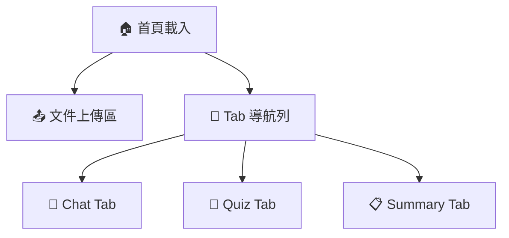
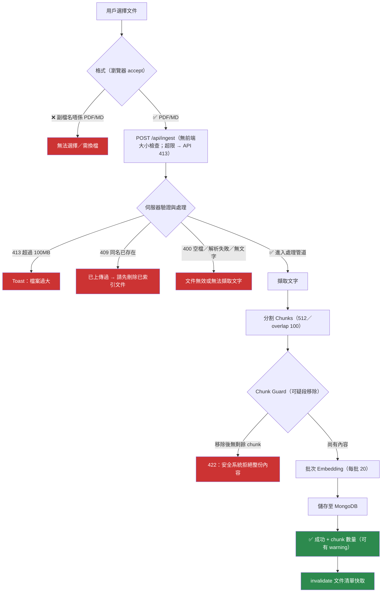
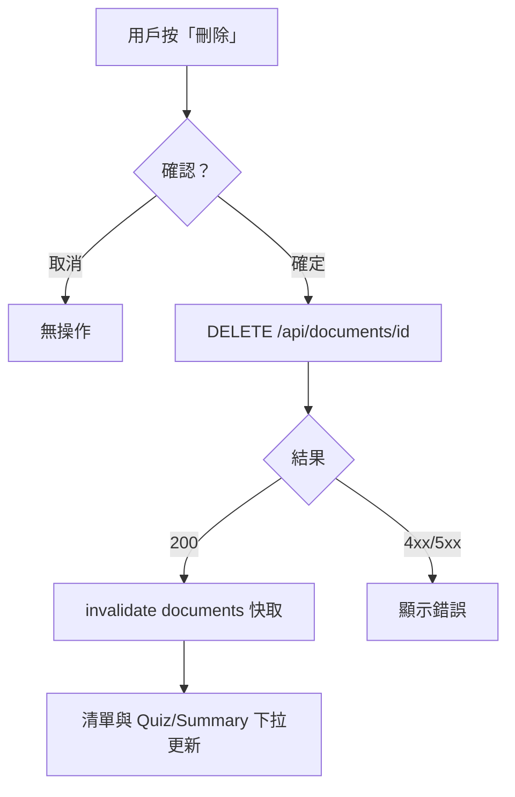
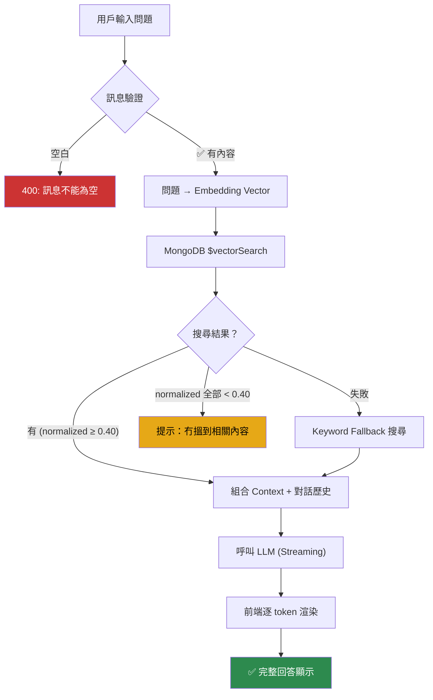
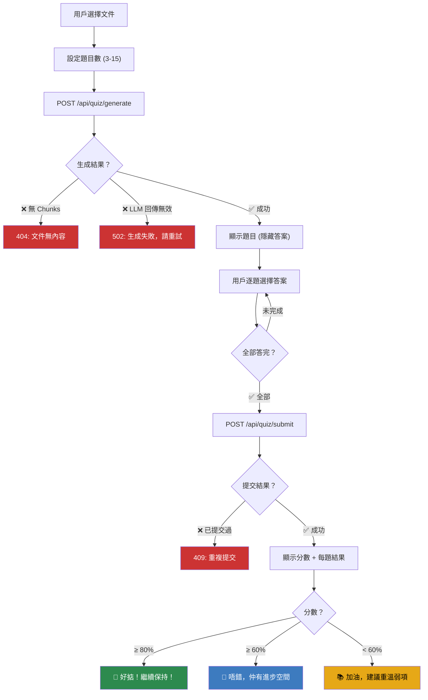
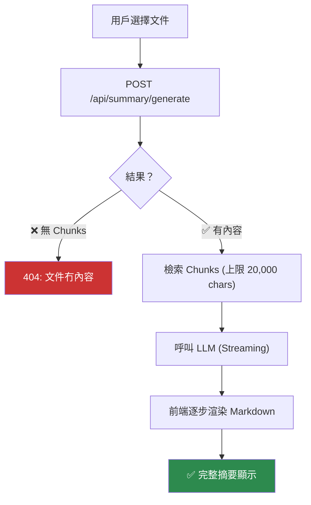
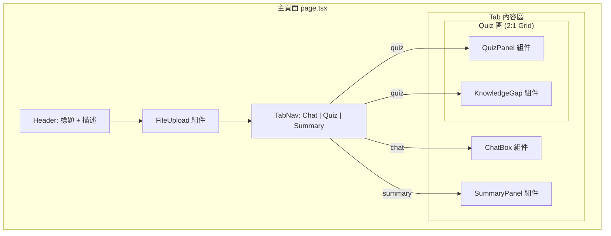
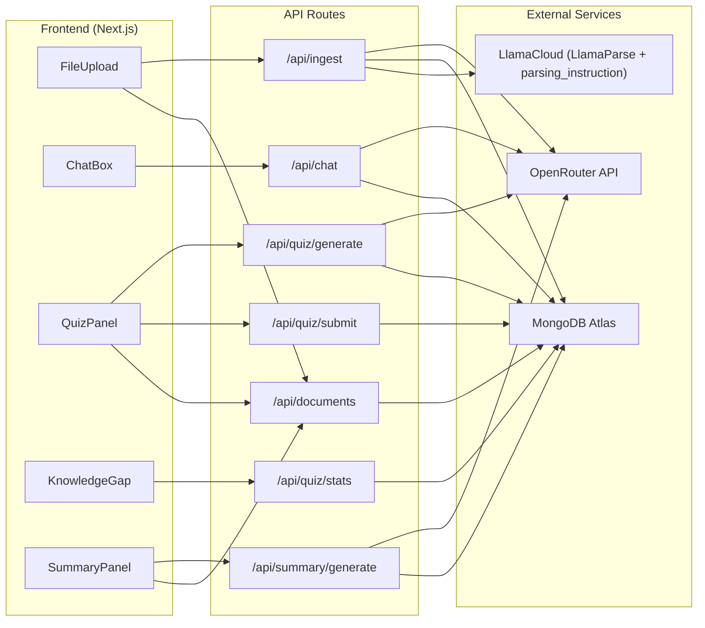

# UI 流程圖 (UI Flow Diagram)

## 1. 應用整體流程

---

## 2. 文件上傳流程

---

## 2a. 已索引文件刪除（簡要）

---

## 3. RAG 聊天流程

> **實作細節**：`$vectorSearch` 結果喺 `search.ts` 會先丟棄 **raw** cosine < **0.60**，再將餘下分數正規化至 0–1；圖中「normalized」即該正規化分數。`chat/route.ts` 只用 normalized ≥ 0.40 嘅 chunk 組 context。

---

## 4. Quiz 完整流程

---

## 5. Summary 生成流程

---

## 6. 頁面組件佈局

---

## 7. 數據流向

---

*更新日期：2026-03-17*
