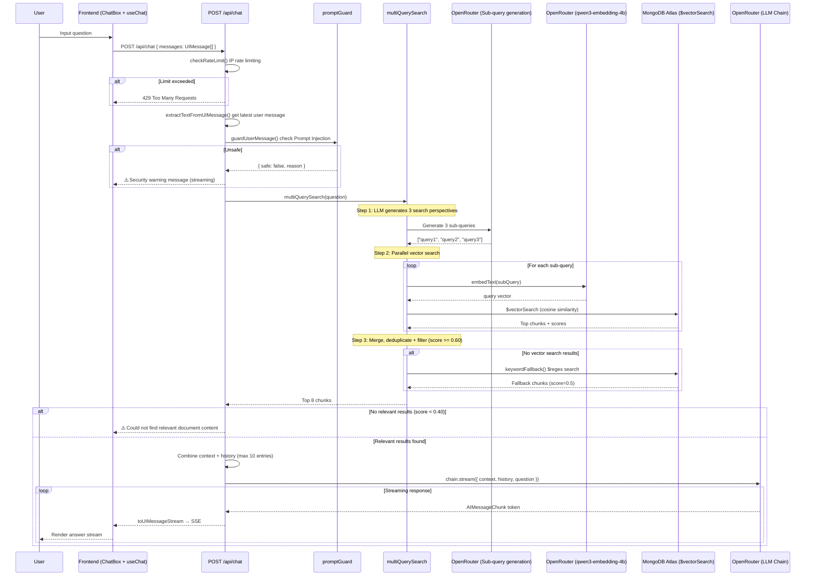
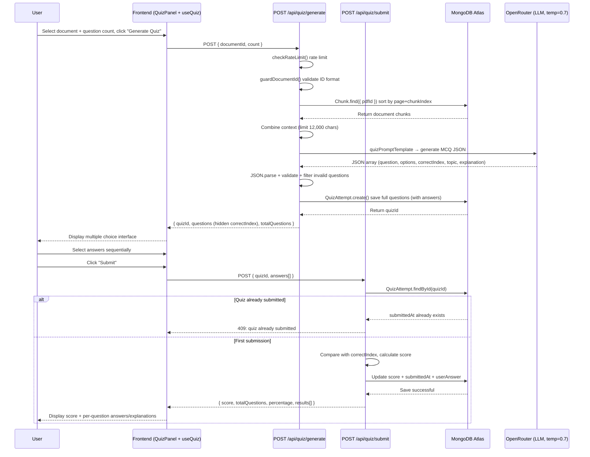
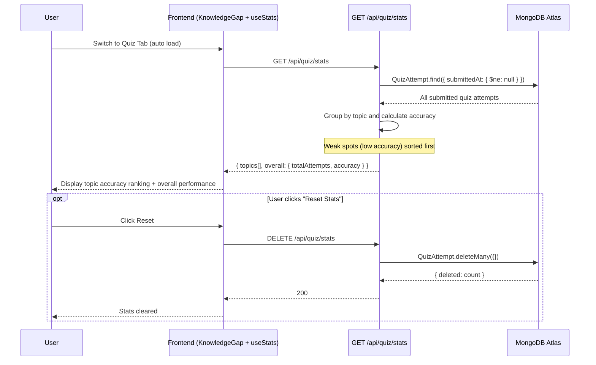
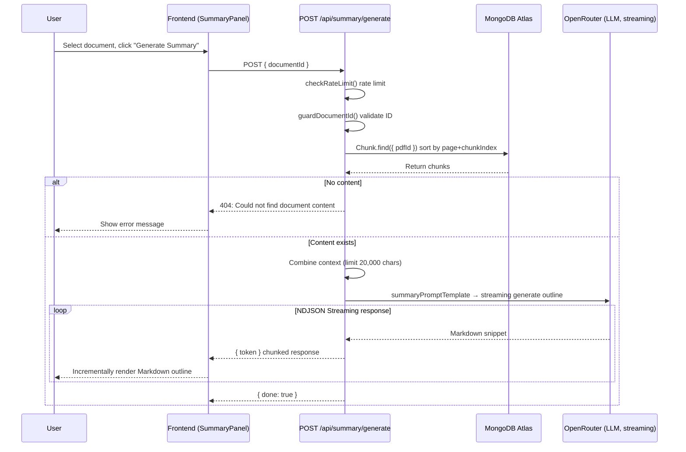
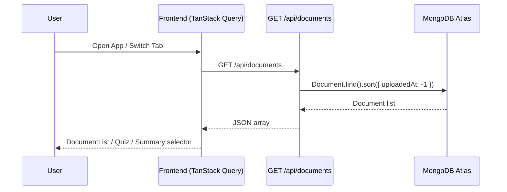
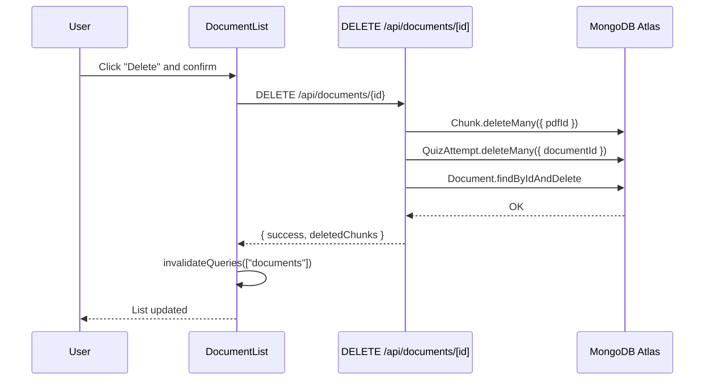

# Sequence Diagrams

Below are the Sequence Diagrams for each core feature of the Revision App, entirely mapped to the actual code under the `src/` directory.

---

## 1. Document Ingestion Flow

> Source: `src/app/api/ingest/route.ts`, `src/lib/pdf.ts`, `src/lib/md.ts`, `src/lib/chunking.ts`, `src/lib/embedding.ts`, `src/lib/promptGuard.ts`

```mermaid
sequenceDiagram
    participant User
    participant Frontend as Frontend (FileUpload)
    participant API as POST /api/ingest
    participant LlamaCloud as LlamaCloud (LlamaParse)
    participant OpenRouter as OpenRouter (qwen3-embedding-4b)
    participant MongoDB as MongoDB Atlas

    User->>Frontend: Upload Document (PDF/MD)
    Note over Frontend: `accept` limits extension; no client-side size check
    Frontend->>API: POST /api/ingest (FormData)
    API->>API: isAcceptedFile() validates MIME/extension
    API->>API: Check file size (max 100MB, 413 if exceeded)

        alt PDF Document
            API->>LlamaCloud: uploadPdf(parsing_instruction) → waitForJob() → fetchMarkdown()
            LlamaCloud-->>API: Return Markdown (paginated by ---)
        else Markdown Document
            API->>API: extractMdText() local parsing
        end

        API->>API: chunkText() split text
        API->>API: guardChunkContent() scan for Prompt Injection
        Note over API: Remove chunks flagged as suspicious

        API->>MongoDB: Document.findOne() check for duplicate name
        alt Duplicate exists
            MongoDB-->>API: Exists
            API-->>Frontend: 409: Document already exists
        else Does not exist
            API->>MongoDB: Document.create() create document record
            loop Every batch of 20 chunks
                API->>OpenRouter: embedTexts() get vectors
                OpenRouter-->>API: Return embedding vectors
            end
            API->>MongoDB: Chunk.insertMany() save chunks + embeddings
            MongoDB-->>API: Save successful
            API-->>Frontend: 200: { success, documentId, chunkCount }
            Frontend-->>User: Show success Toast
        end
```

---

## 2. RAG Smart Chat Flow

> Source: `src/app/api/chat/route.ts`, `src/lib/search.ts`, `src/lib/promptGuard.ts`, `src/lib/rateLimiter.ts`



---

## 3. Quiz Generation & Submission Flow

> Source: `src/app/api/quiz/generate/route.ts`, `src/app/api/quiz/submit/route.ts`, `src/hooks/useQuiz.ts`



---

## 4. Knowledge Gap Stats Flow

> Source: `src/app/api/quiz/stats/route.ts`, `src/components/KnowledgeGap.tsx`, `src/hooks/useStats.ts`



---

## 5. Summary Generation Flow

> Source: `src/app/api/summary/generate/route.ts`, `src/components/SummaryPanel.tsx`



---

## 6. Document List Loading Flow

> Source: `src/app/api/documents/route.ts`, `src/components/DocumentList.tsx` (`useQuery` / `useMutation`, `queryKey: ["documents"]`), `src/context/UploadContext.tsx` (on ingest success `invalidateQueries({ queryKey: ["documents"] })`)



---

## 7. Delete Indexed Document Flow

> Source: `src/app/api/documents/[id]/route.ts`, `src/components/DocumentList.tsx`



---
*Updated: 2026-03-26 — Mapped to actual `src/` codebase*

