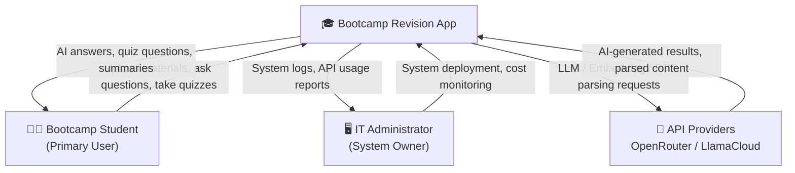

# Stakeholder Map

> **Purpose**: Identify all stakeholders who influence or are affected by the system. Understand their needs, concerns, and communication strategies to ensure the system design balances all interests.

---

## Stakeholder Overview



---

## Detailed Stakeholder Analysis

### 1. 👩‍🎓 Bootcamp Student (Primary User)

| Attribute | Description |
|-----------|-------------|
| **Role** | Primary end user, directly uses the system to revise course materials |
| **Key Needs** | Quickly locate answers in materials, self-assess through quizzes, identify weak topics |
| **Concerns** | Response speed (low tolerance for delays), AI answer accuracy, interface usability |
| **Success Criteria** | 30% reduction in material retrieval time; 20% improvement in quiz pass rate |
| **Risk** | If AI produces hallucinations, students may learn incorrect knowledge |
| **Communication** | In-app error messages, UI feedback, user surveys |
| **Engagement Level** | 🔴 High (continuous use) |

---

### 2. 🖥️ IT Administrator (System Owner)

| Attribute | Description |
|-----------|-------------|
| **Role** | Responsible for system deployment, maintenance, and cost control |
| **Key Needs** | Stable system operations, security compliance, controllable API costs |
| **Concerns** | MongoDB Atlas M0 storage limit (512MB), OpenRouter API costs, security vulnerabilities |
| **Success Criteria** | System availability ≥ 99%; monthly API costs within budget; zero security incidents |
| **Risk** | Free tier limits exceeded; rate limiting failure causing cost overruns |
| **Communication** | System logs, API usage dashboard, periodic cost reports |
| **Engagement Level** | 🟡 Medium (monthly monitoring) |

---

### 3. 🔌 API Providers (OpenRouter / LlamaCloud)

| Attribute | Description |
|-----------|-------------|
| **Role** | Technical partners providing LLM, Embedding, and PDF parsing services |
| **Key Needs** | Reasonable API usage (compliant with rate limits and Terms of Service) |
| **Concerns** | Request frequency, data privacy compliance, free tier usage limits |
| **Success Criteria** | System request behaviour complies with provider ToS; no abuse alerts triggered |
| **Risk** | Free tier discontinued; model deprecated requiring migration (OpenRouter unified API mitigates this) |
| **Communication** | API documentation, provider Status Page, error response messages |
| **Engagement Level** | 🟢 Low (passive, on-demand) |

---

## Needs Conflict Analysis & Balancing Strategies

Different stakeholders have potentially competing needs. The BA identifies these and proposes balancing strategies:

| Conflict Scenario | Stakeholder A Need | Stakeholder B Need | Balancing Strategy |
|-------------------|-------------------|-------------------|-------------------|
| Speed vs. Accuracy | Students: want instant answers | IT Admin: wants to control API costs | Rate limiting (20 req/min) balances speed and cost |
| Parsing Quality vs. Cost | Students: want all PDFs accurately parsed | IT Admin: LlamaCloud free tier has page limits | Use LlamaParse for improved scanned PDF accuracy; inform users of quota limits via frontend |
| AI Freedom vs. Security | Students: want AI to answer as broadly as possible | IT Admin: prevent Prompt Injection and system abuse | Vard Guard + Chunk Content Guard blocks malicious activity without impacting legitimate use |

---

## Stakeholder Interest / Power Matrix

```
          High Power (High Influence)
               │
    IT Admin    │
    (Controls   │
     deployment │
     & budget)  │
               │                    Students
               │              (Product success
High ──────────┼────────────── depends on their
Interest       │               adoption rate)
               │
               │    API Providers
               │    (External dependency,
               │     passive participant)
               │
          Low Power (Low Influence)
```

| Quadrant | Stakeholder | Strategy |
|----------|-------------|----------|
| High Power + High Interest | IT Administrator | **Manage Closely**: Provide regular system reports, proactively communicate cost changes |
| Low Power + High Interest | Bootcamp Students | **Keep Satisfied**: Prioritise user feedback, respond quickly to experience issues |
| Low Power + Low Interest | API Providers | **Monitor**: Periodically check ToS changes, set up API usage alerts |

---

*Last updated: 2026-03-24*
