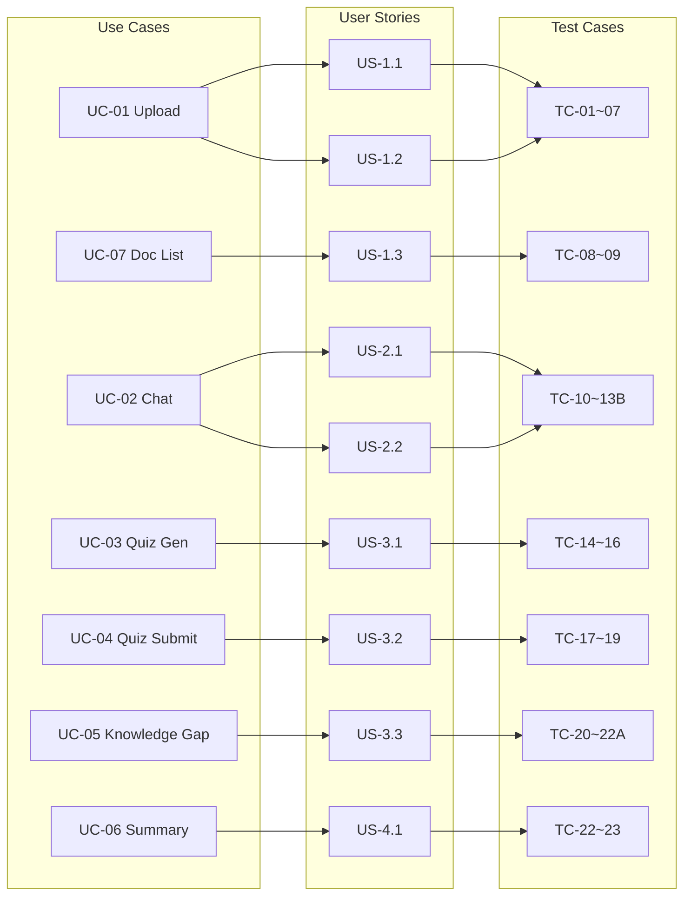

# Requirements Traceability Matrix

> **Purpose**: Ensure every requirement has corresponding implementation, testing, and verification with no gaps.

---

## 1. Use Case ↔ User Story ↔ Test Case Mapping

| Use Case | User Story | Test Case(s) | API Endpoint | UI Component | Impl. Status | UAT Status | User Feedback |
|----------|-----------|--------------|--------------|-------------|----------|----------|----------|
| UC-01 Upload PDF | US-1.1 | TC-01, TC-03~07 | `POST /api/ingest` | `FileUpload` | ✅ Implemented | ⏳ Pending | — |
| UC-01 Upload MD | US-1.2 | TC-02 | `POST /api/ingest` | `FileUpload` | ✅ Implemented | ⏳ Pending | — |
| UC-02 RAG Chat | US-2.1, US-2.2 | TC-10~13B | `POST /api/chat` | `ChatBox` | ✅ Implemented | ⏳ Pending | — |
| UC-03 Quiz Generation | US-3.1 | TC-14~16 | `POST /api/quiz/generate` | `QuizPanel` | ✅ Implemented | ⏳ Pending | — |
| UC-04 Quiz Submission | US-3.2 | TC-17~19 | `POST /api/quiz/submit` | `QuizPanel` | ✅ Implemented | ⏳ Pending | — |
| UC-05 Knowledge Gap | US-3.3 | TC-20~22A | `GET /api/quiz/stats` `DELETE /api/quiz/stats` | `KnowledgeGap` | ✅ Implemented | ⏳ Pending | — |
| UC-06 Summary | US-4.1 | TC-22, TC-23 | `POST /api/summary/generate` | `SummaryPanel` | ✅ Implemented | ⏳ Pending | — |
| UC-07 Document List | US-1.3 | TC-08, TC-09 | `GET /api/documents` | `FileUpload`(dropdown) | ✅ Implemented | ⏳ Pending | — |

> **UAT Status legend**: ⏳ Pending → 🔄 In Progress → ✅ Passed (fill in date) → ❌ Failed (record issue)

---

## 2. User Story ↔ Acceptance Criteria ↔ Test Case Detail

### Epic 1: Document Management

| User Story | Acceptance Criteria | Test Case | Coverage |
|-----------|-------------------|-----------|----------|
| US-1.1 Upload PDF | Supports `.pdf` format | TC-01 | ✅ |
| | Auto extract, split, embed, store | TC-01 | ✅ |
| | Shows success message (with chunk count) | TC-01 | ✅ |
| | Duplicate filename returns 409 | TC-06 | ✅ |
| | Empty/corrupted file shows clear error | TC-04, TC-07 | ✅ |
| | File size limit 100MB | TC-05 | ✅ |
| US-1.2 Upload MD | Supports `.md`, `.markdown` formats | TC-02 | ✅ |
| | Processing flow same as PDF | TC-02 | ✅ |
| US-1.3 View Documents | Shows filename, chunk count, upload time | TC-08 | ✅ |
| | Sorted by upload time descending | TC-08 | ✅ |

### Epic 2: RAG Chat

| User Story | Acceptance Criteria | Test Case | Coverage |
|-----------|-------------------|-----------|----------|
| US-2.1 Chat Review | Only answers based on uploaded documents | TC-10 | ✅ |
| | Response language matches input | TC-10 | ✅ |
| | Streaming token-by-token display | TC-10, TC-NF-02 | ✅ |
| | Retains most recent 10 conversation history | TC-13 | ✅ |
| US-2.2 Search Tolerance | Keyword fallback on vector search failure | TC-11 | ✅ |
| | Clear prompt when no relevant results | TC-11 | ✅ |

### Epic 3: Quiz Practice

| User Story | Acceptance Criteria | Test Case | Coverage |
|-----------|-------------------|-----------|----------|
| US-3.1 Auto Generation | Can select target document | TC-14 | ✅ |
| | Question count 3-15 | TC-16 | ✅ |
| | Each question has 4 options | TC-14 | ✅ |
| | Each question tagged with topic + explanation | TC-14 | ✅ |
| | Tests comprehension | TC-14 *(manual check)* | ⚠️ |
| | Correct answers hidden during answering | TC-14 | ✅ |
| US-3.2 Submit & Score | Must answer all before submitting | TC-17 | ✅ |
| | Shows score, percentage | TC-17 | ✅ |
| | Each question shows correct answer, user answer, explanation | TC-17 | ✅ |
| | Each question labeled with topic | TC-17 | ✅ |
| | Same quiz can only be submitted once | TC-18 | ✅ |
| US-3.3 Knowledge Gap | Accuracy displayed grouped by topic | TC-20 | ✅ |
| | Weak topics sorted first | TC-20 | ✅ |
| | Shows overall statistics | TC-20 | ✅ |

### Epic 4: Summary

| User Story | Acceptance Criteria | Test Case | Coverage |
|-----------|-------------------|-----------|----------|
| US-4.1 Study Outline | Can select target document | TC-22 | ✅ |
| | Structured Markdown (chapters, key points, definitions) | TC-22 | ✅ |
| | 🔑 Marks key knowledge points | TC-22 *(manual check)* | ⚠️ |
| | Streaming progressive display | TC-22, TC-NF-02 | ✅ |
| | Language matches source document | TC-22 *(manual check)* | ⚠️ |

---

## 3. Coverage Statistics

### By Use Case

| Use Case | Test Cases | Coverage |
|----------|-----------|----------|
| UC-01 | 6 | ✅ 100% |
| UC-02 | 5 | ✅ 100% |
| UC-03 | 3 | ✅ 100% |
| UC-04 | 3 | ✅ 100% |
| UC-05 | 3 | ✅ 100% |
| UC-06 | 2 | ✅ 100% |
| UC-07 | 2 | ✅ 100% |

### By User Story

| Metric | Value |
|--------|-------|
| Total Acceptance Criteria | 31 |
| Automatable test coverage | 28 (90%) |
| Requires manual verification | 3 (10%) |
| Not covered | 0 (0%) |

### By API Endpoint

| Endpoint | Test Cases | Happy Path | Error Handling |
|----------|-----------|------------|----------------|
| `POST /api/ingest` | 6 | TC-01, TC-02 | TC-03, TC-04, TC-05, TC-06, TC-07 |
| `GET /api/documents` | 2 | TC-08 | TC-09 |
| `POST /api/chat` | 5 | TC-10, TC-13, TC-13B | TC-11, TC-12 |
| `POST /api/quiz/generate` | 3 | TC-14, TC-16 | TC-15 |
| `POST /api/quiz/submit` | 3 | TC-17 | TC-18, TC-19 |
| `GET /api/quiz/stats` | 2 | TC-20 | TC-21 |
| `DELETE /api/quiz/stats` | 1 | TC-22A | — |
| `POST /api/summary/generate` | 2 | TC-22 | TC-23 |

---

## 4. Manual Review Standards

The following items involve AI generation quality judgements and require human evaluation:

### AI Quiz Quality Rubric

> **Scope**: TC-14 manual verification (AC-3.1.5: questions test comprehension vs. rote memorisation)
> **Scoring**: Each dimension 1–5 points. Total ≥ 16/20 = pass; < 12/20 = regenerate

| Dimension | 1 (Fail) | 3 (Pass) | 5 (Excellent) | Review Focus |
|-----------|----------|----------|---------------|-------------|
| **Question Clarity** | Ambiguous, multiple valid interpretations | Mostly clear, minor ambiguity | Precise, unambiguous, immediately understandable | Does the stem include enough context? Avoid openers like "Which of the following" without sufficient setup |
| **Distractors** | Wrong options are obviously incorrect | Some options have limited plausibility | All wrong options represent realistic misconceptions — correct answer requires genuine understanding | Do wrong options come from related concepts in the material? Avoid irrelevant/absurd distractors |
| **Explanation Quality** | Only states "Answer is X", no reasoning | Brief explanation of why correct | Detailed reasoning + why other options are wrong + learning extension | Does the explanation build real understanding, not just answer recall? |
| **Knowledge Level (Bloom's)** | Pure recall (memorise definition, repeat steps) | Understand + Apply (explain concept, simple application) | Analyse + Evaluate (compare approaches, judge scenario appropriateness) | Does the question require students to *think* rather than *remember*? |

### Other Items Requiring Manual Verification

| ID | Item | Review Standard |
|----|------|----------------|
| ⚠️ AC-4.1.3 | Summary 🔑 marks key knowledge points | Are marked points genuinely core concepts for the topic? Confirmed by domain expert |
| ⚠️ AC-4.1.5 | Summary language matches source document | English input → English output; Chinese input → Chinese output; no mixing |
| ⚠️ AC-2.1-NP | RAG Hallucination Control | When material lacks relevant content, does AI explicitly say "not covered" rather than fabricating? |

---

## 5. Traceability Matrix Diagram

---

*Last updated: 2026-03-24*
