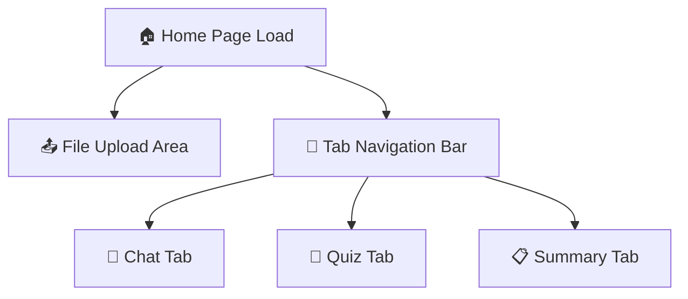
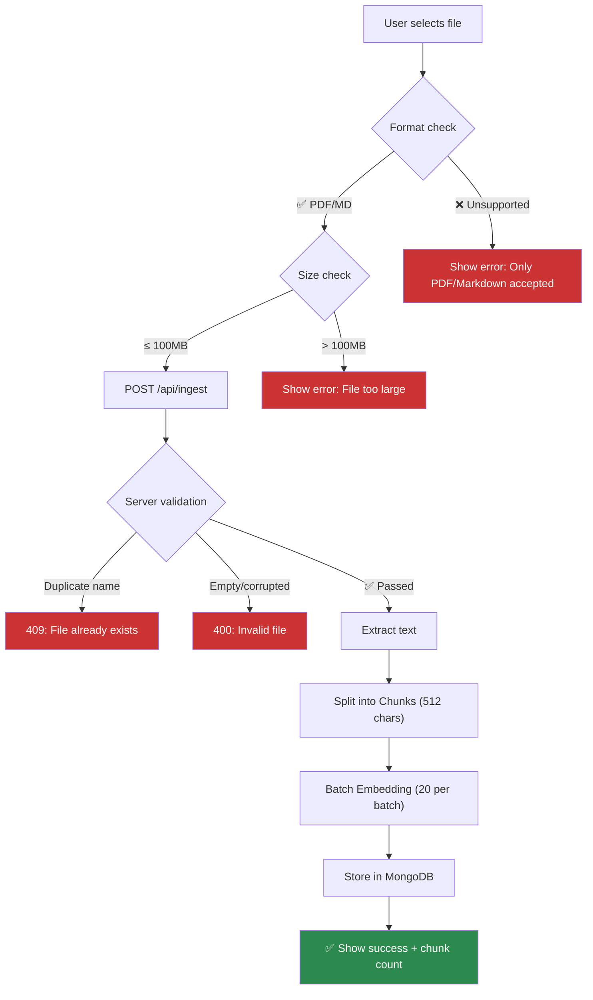
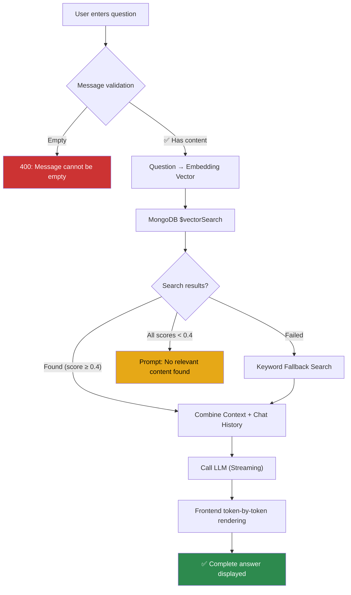
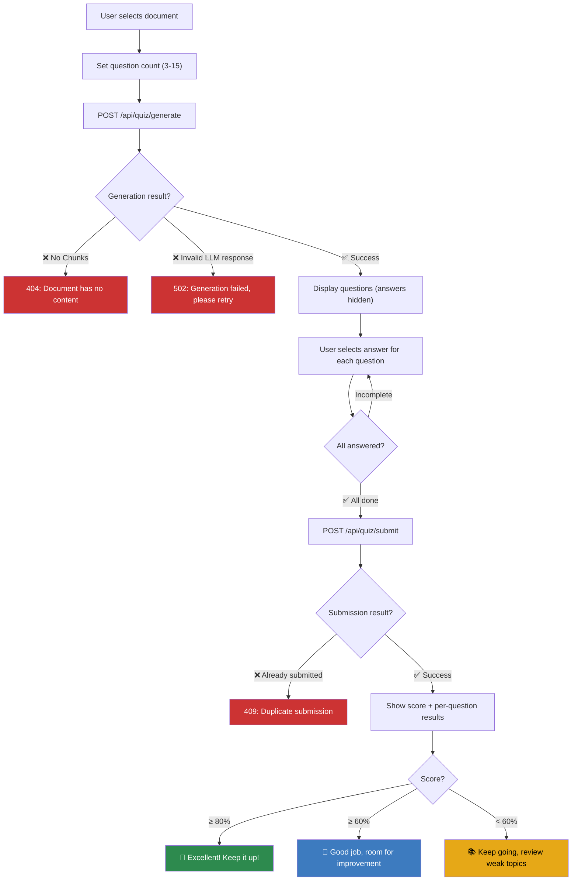
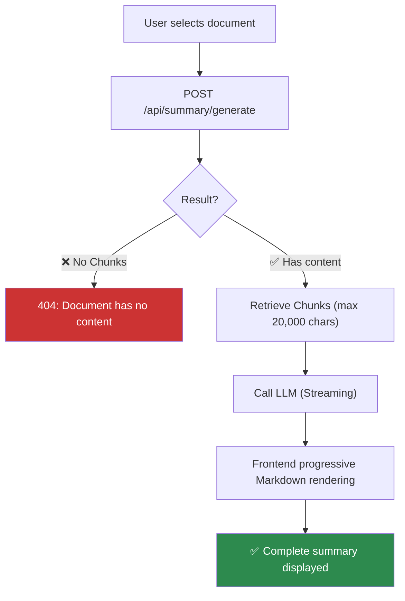
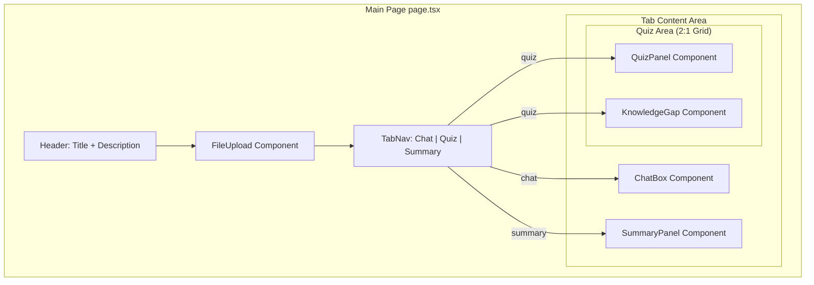
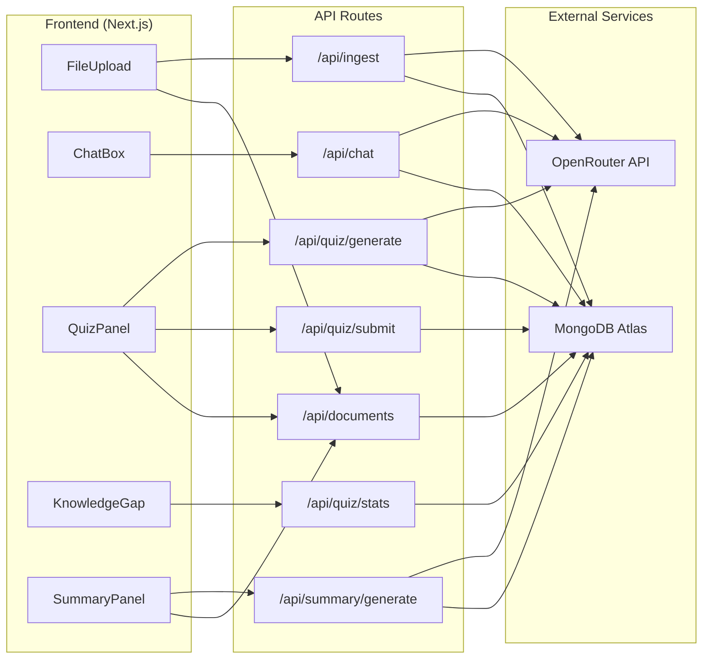

# UI Flow Diagram

## 1. Overall Application Flow

---

## 2. File Upload Flow

---

## 3. RAG Chat Flow

---

## 4. Quiz Complete Flow

---

## 5. Summary Generation Flow

---

## 6. Page Component Layout

---

## 7. Data Flow

---

*Last updated: 2026-03-17*
