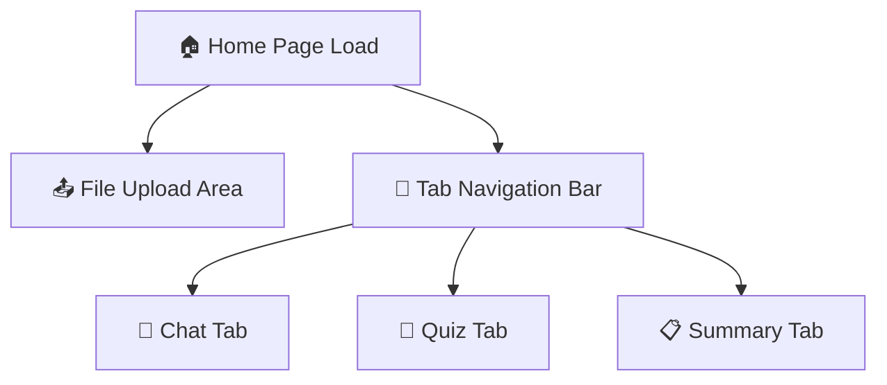
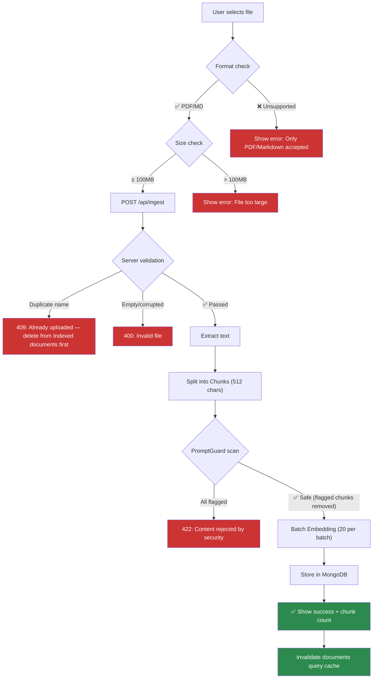
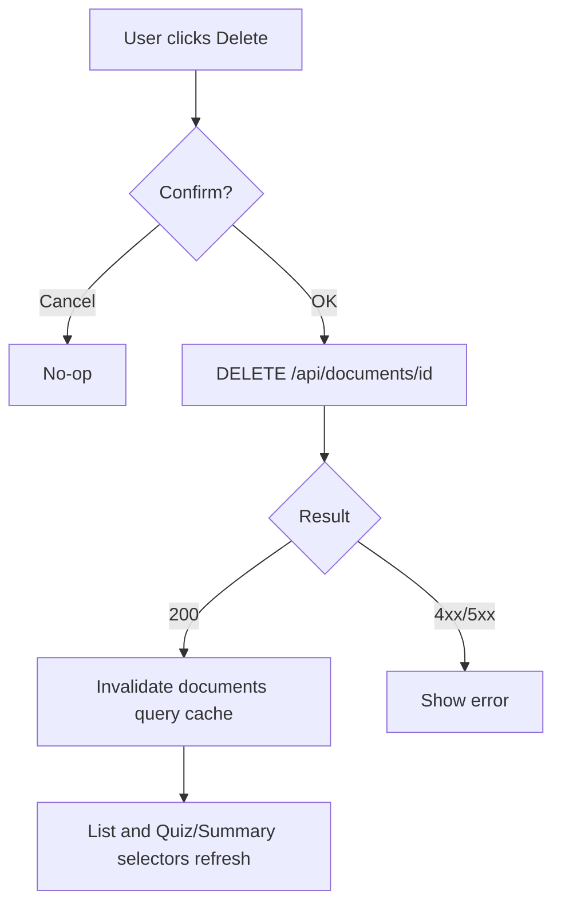
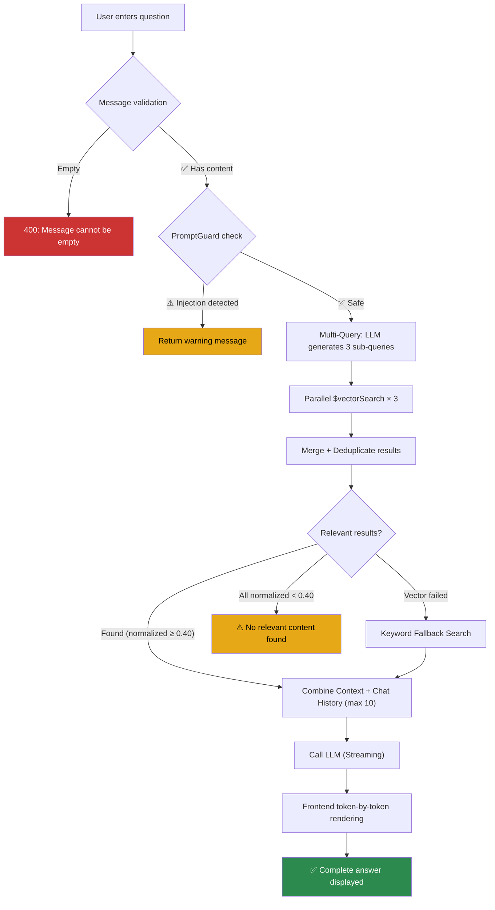
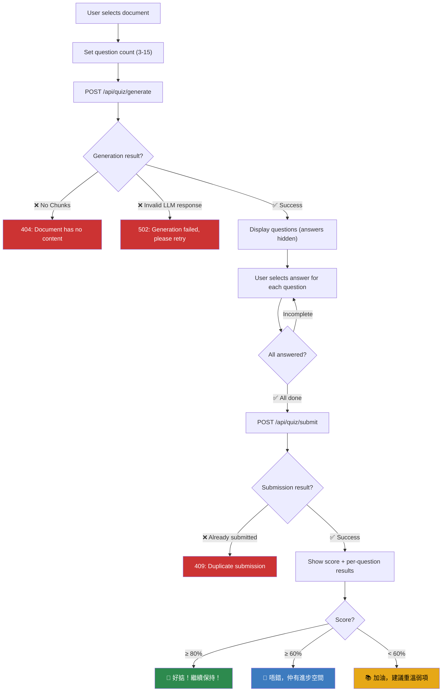
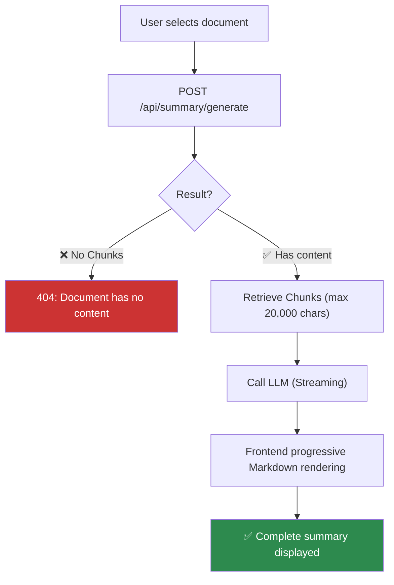
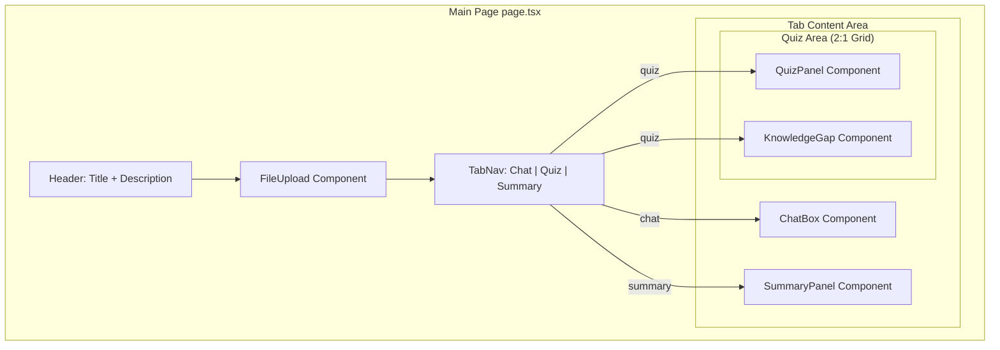
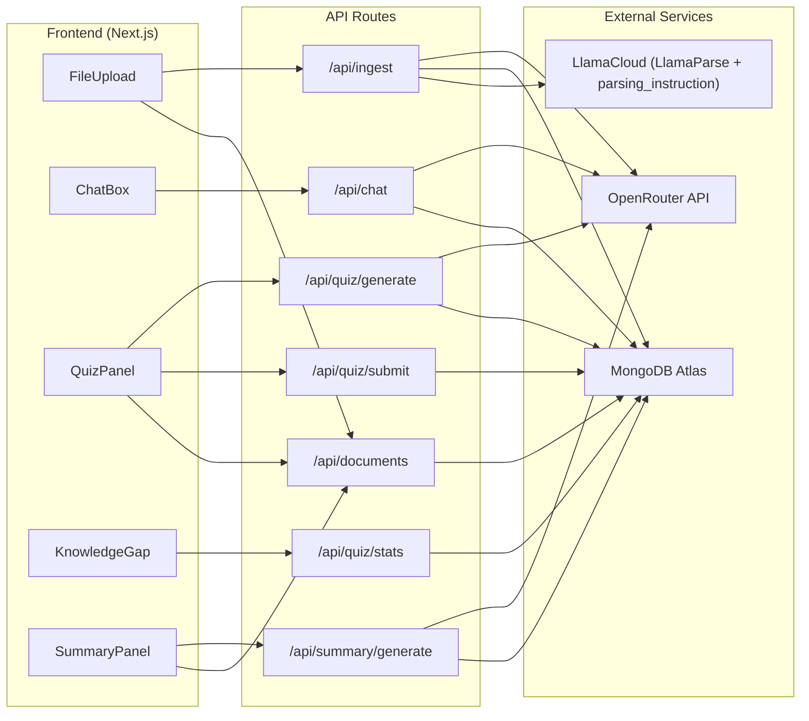

# UI Flow Diagram

## 1. Overall Application Flow

---

## 2. File Upload Flow

---

## 2a. Delete Indexed Document (summary)

---

## 3. RAG Chat Flow

> **Implementation**: After `$vectorSearch`, `search.ts` drops chunks with **raw** cosine < **0.60**, then normalizes remaining scores to 0–1. The diagram’s “normalized” refers to that value; `chat/route.ts` only builds context from chunks with normalized ≥ **0.40**.

---

## 4. Quiz Complete Flow

---

## 5. Summary Generation Flow

---

## 6. Page Component Layout

---

## 7. Data Flow

---

*Last updated: 2026-03-24*
